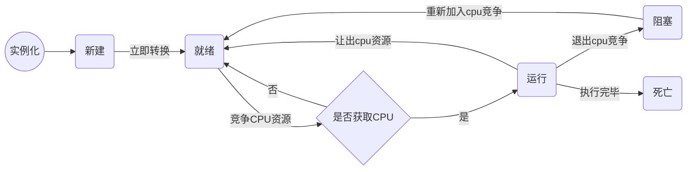

# 线程的生命周期

## 线程生命周期的五个状态

### 新建（new）

当线程对象被实例化以后，实例就处于新建状态，随后立即进入就绪状态。

### 就绪（runnable）

线程对象实例化以后，实例没有被阻塞，只要获得CPU就可以执行线程执行体（run方法），此时处于就绪状态，线程在竞争CPU资源。

### 运行（running）

处于就绪状态的线程实例，获得了CPU资源，可以执行线程方法体（run方法），此时处于运行状态。

### 阻塞（block）

处于阻塞状态的线程不会去竞争CPU资源。

- 以下几种操作会将线程进入阻塞状态：

  1. 调用sleep方法，进入休眠，主动放弃CPU
  2. 调用了阻塞式IO方法，方法返回前，线程被阻塞
  3. 线程试图获得一个同步监视器锁，而该监视器锁被其他线程持有
  4. 线程正在等待某个通知（notify）
  5. 程序调用了suspend方法将线程挂起（容易导致死锁）

- 阻塞状态只能转化为就绪状态，以下几种操作可以进行转化（和上面对应）

  1. 调用的sleep方法经过了指定的休眠时间
  2. 阻塞式IO调用执行完毕，返回
  3. 线程成功获得了监视器锁
  4. 线程正在等待的通知（notify）被其他线程发出
  5. 处于挂起状态的线程调用了resume恢复方法

### 死亡（dead）

线程执行完毕，就是死亡。

- 以下方式会使线程进入死亡状态

  1. run方法执行完毕
  2. 线程抛出未捕获的exception或error
  3. 直接调用线程的stop方法（容易造成死锁）

## 线程生命周期流程图

# 线程的安全性

## 什么是线程安全

当多个线程访问某个类对象实例的状态变量（静态变量或实例变量）时，都能始终变现出符合预期的正确行为，那么这个类可以认为是线程安全的。

+ 不管运行时环境采用何种调度方式，都不会出错
+ 不管线程交替执行的方式，都不会出错
+ 调用代码中不需要额外的同步操作

## 对象实例的状态

- 对象实例的状态是指存储在状态变量（实例变量或静态变量）中的数据。
- 对象的状态还可能包括其他依赖对象的域，例如HashMap实例的状态不仅存储在实例本身，还存储在Map.Entry对象实例中。
- 对象的状态包含了任何可能影响其外部可见行为的数据。
- 如果多个线程访问一个可变的状态变量时没有合适的同步机制，那么程序就会出错，有下面三种方式可以修复这个问题：

  1. 不在线程之间共享该状态变量
  2. 将状态变量修改为不可变的变量
  3. 在访问变量时使用同步控制
  
- 无状态的对象一定是线程安全的。
- 线程安全的类已经封装了必要的同步机制，因此调用方无须采取额外的同步机制。

## 原子性

### 竞态条件

由于不恰当的执行时序而出现不正确结果的情况，称为竞态条件。竞态条件会破坏原子性。

- 先检查后执行：CAS操作
- 读取-修改-写入：i++操作
- 修改-写入-读取：++i操作

### 原子操作

一次搞定的操作，要么成功，要么失败。

~~~
int i;
~~~

### 复合原子操作

对于访问同一个状态的所有操作（包括该操作本身），每一个操作都是以原子的方式进行的

- 不管这个操作是由多少个更小的操作复合而成
- 这个操作的结果不会被访问同一个状态的其他操作的时序影响

## Synchronized加锁机制

### 内置锁

- 同步代码块（Synchronized Block）以关键字synchronized修饰的方法或代码块。同步该代码块的锁就是代码所在的对象实例，静态的synchronized方法以Class对象作为锁。
- 每个Java对象实例都可以用作一个同步的锁，被称为内置锁（Intrinsic Lock）或监视器锁（Monitor Lock）。线程进入同步代码块时会自动获得锁，并且在退出同步代码块时自动释放锁（不论正常退出还是抛出异常）。获得内置锁的唯一途径就是进入同步代码块。
- 内置锁时一种互斥锁，最多只有一个线程可以持有这种锁。

### 重入锁

- 当线程请求一个其他线程持有的锁时，发出请求的线程会被阻塞。
- 由于内置锁是可重入的，所以一个线程请求一个自己持有的锁时，这个请求会成功。
- “重入”代表锁的操作粒度时“线程”而不是“调用”。

