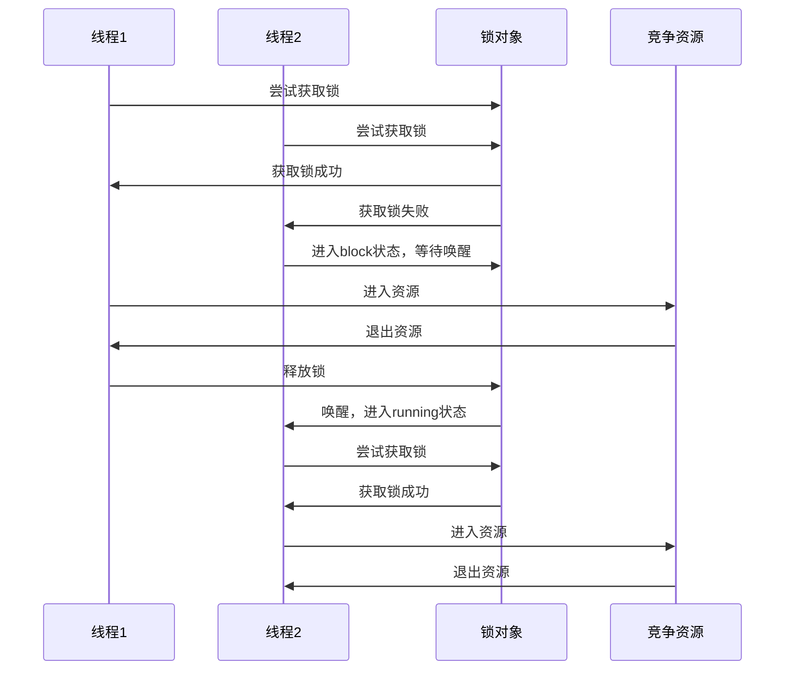
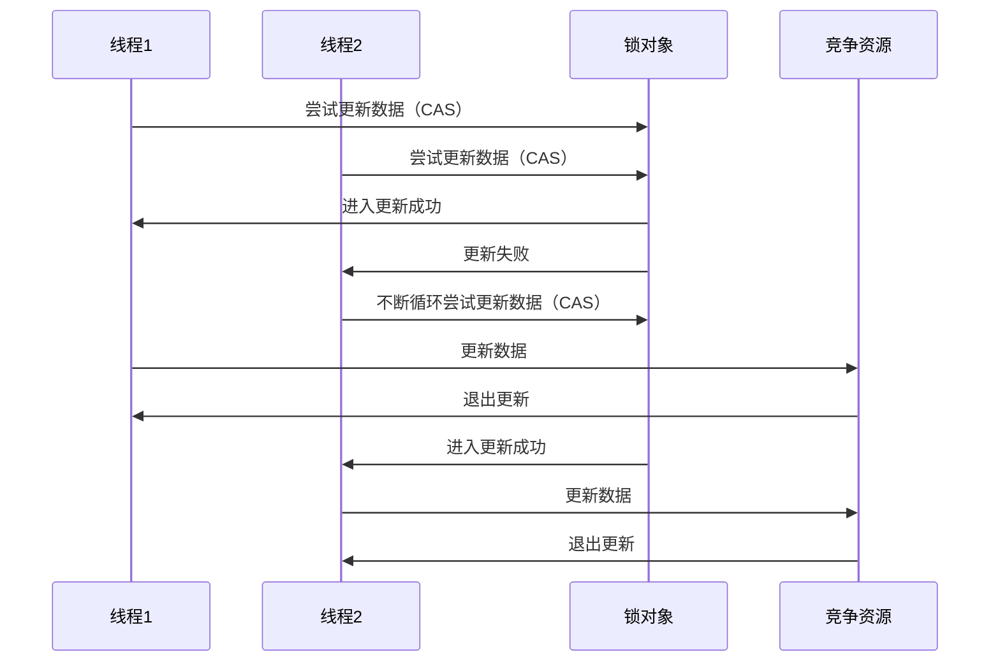
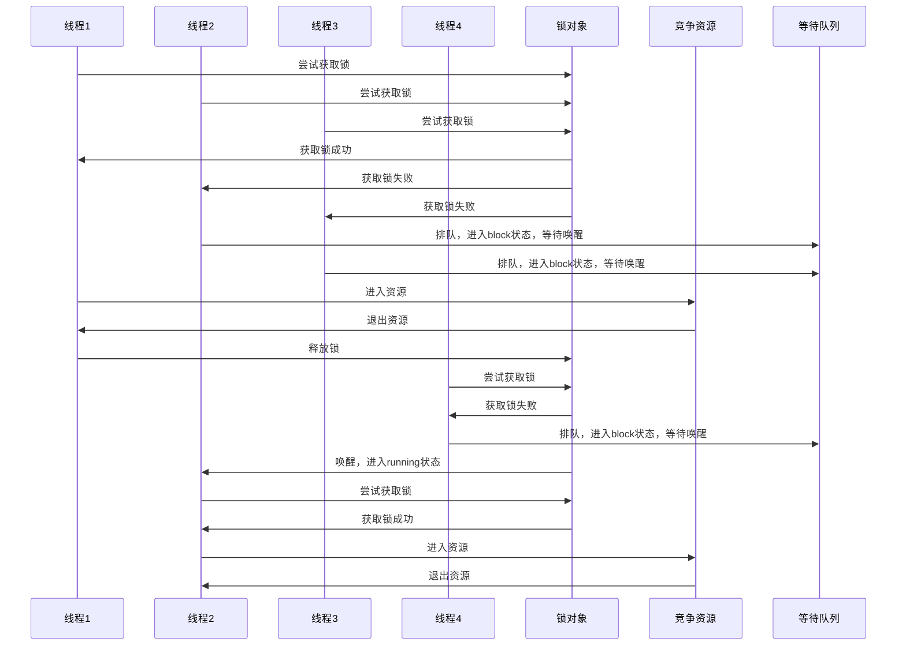
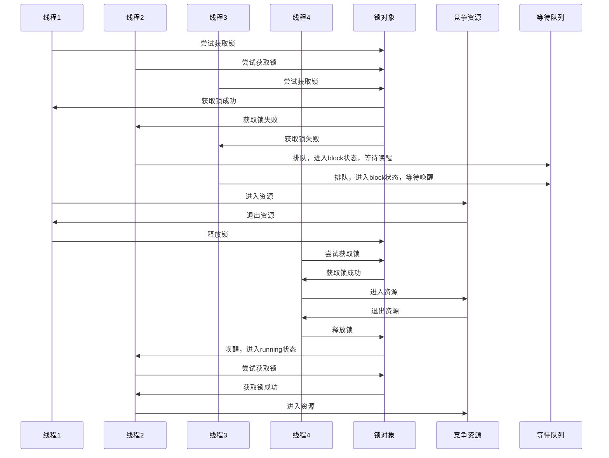

# 锁的几种分类方式

## 线程是否锁住同步资源

### 悲观锁

对于同一个数据的并发操作，悲观锁认为自己在使用数据的时候一定有别的线程来修改数据，因此在获取数据的时候会先加锁，确保数据不会被别的线程修改。Java中，synchronized关键字和Lock的实现类都是悲观锁。



#### 使用synchronized的悲观锁

1. 锁定当前对象实例

     ```java
     public synchronized void lockFunction() {
      	   // do something on racing resources
     }
     ```

2. 锁定当前类class

   ```java
   public static synchronized void lockFunction() {
    	// do something on racing resources
   }
   ```

3. 锁定锁对象

   ```java
   public void lockFunction() {
   	synchronized (lockObject) {
           // do something on racing resources
   	}
   }
   ```

#### 使用Lock实现类的悲观锁

```java
// ReentrantLock
private ReentrantLock lock = new ReentrantLock(); // 需要保证多个线程使用的是同一个锁
public void modifyPublicResources() {
    try {
		lock.lock();
		// do something on racing resources
    } finally {
		lock.unlock();
    }
}
```

### 乐观锁

对于同一个数据的并发操作，乐观锁认为自己在使用数据时不会有别的线程修改数据，所以不会添加锁，只是在更新数据的时候去判断之前有没有别的线程更新了这个数据。如果这个数据没有被更新，当前线程将自己修改的数据成功写入。如果数据已经被其他线程更新，则根据不同的实现方式执行不同的操作（例如报错或者自动重试）。

乐观锁在Java中是通过使用无锁编程来实现，最常采用的是CAS算法。



```java
// ------------------------- 乐观锁的调用方式 -------------------------
private AtomicInteger atomicInteger = new AtomicInteger();  // 多个线程使用的是同一个AtomicInteger
atomicInteger.incrementAndGet(); //执行自增1
```

## 竞争锁失败，线程是否阻塞

### 同步锁

参见悲观锁的代码例子。

线程进入blocking状态，等待锁释放后的唤醒操作，重新进入running状态后再次竞争锁。

### 自旋锁

参见乐观锁的代码例子。

竞争资源失败的线程进行自旋，如果在自旋完成后前面锁定同步资源的线程已经释放了锁，那么当前线程就可以不必阻塞而是直接获取同步资源，从而避免切换线程的开销。这就是自旋锁。


### 适应性自旋锁

自旋锁本身是有缺点的，它不能代替阻塞。自旋等待虽然避免了线程切换的开销，但它要占用处理器时间。如果锁被占用的时间很短，自旋等待的效果就会非常好。反之，如果锁被占用的时间很长，那么自旋的线程只会白浪费处理器资源。所以，自旋等待的时间必须要有一定的限度，如果自旋超过了限定次数（默认是10次，可以使用-XX:PreBlockSpin来更改）没有成功获得锁，就应当挂起线程。
适应性自旋锁意味着自旋的时间（次数）不再固定，而是由前一次在同一个锁上的自旋时间及锁的拥有者的状态来决定。虚拟机会根据当前运行情况来判断可以自旋的时间，如果超时还没有竞争到资源，则直接阻塞线程，避免浪费处理器资源。

## 多个线程竞争锁时是否排队

### 公平锁

公平锁是指多个线程按照在锁释放时一定会重新竞争尝试获取锁，胜利者才能获得锁。CPU唤醒阻塞线程的开销比非公平锁大。

- 等待线程不会饿死
- 锁被释放后一定有线程切换的唤醒操作
- Synchronized锁是公平锁，但是不排队，乱序竞争



```java
// ReentrantLock 默认是非公平锁，需要在构建函数中指定是否公平才能使用公平锁
private ReentrantLock lock = new ReentrantLock(true);
```

### 非公平锁

非公平锁是多个线程加锁时直接尝试获取锁，获取不到才会进入block状态等待唤醒。但如果此时锁刚好可用，那么这个线程可以无需阻塞直接获取到锁，所以非公平锁有可能出现后申请锁的线程先获取锁的场景。非公平锁的整体的吞吐效率高，因为线程有几率不阻塞直接获得锁，CPU不必唤醒所有线程。

- 等待线程可能饿死
- 锁被释放后有可能不用切换线程就可以马上被获取，减少了一次线程切换



```java
// ReentrantLock 默认是非公平锁，也可以在构建函数中指定是否公平使用非公平锁
private ReentrantLock lock = new ReentrantLock();
private ReentrantLock lock = new ReentrantLock(false);
```

## 多个线程是否可以共享锁

### 共享锁

共享锁也叫写锁，是指该锁可被多个线程所持有。如果线程T对数据A加上共享锁后，则其他线程只能对A再加共享锁，不能加排它锁。

```java
// 多个线程使用的是同一个ReentrantReadWriteLock
private ReentrantReadWriteLock reentrantReadWriteLock = new ReentrantReadWriteLock();
public void readLock() {
    ReentrantReadWriteLock.ReadLock lock = reentrantReadWriteLock.readLock();
    try {
      lock.lock();
      // 多个线程可以一起同时读，但是不能写
      // do something on racing resources 
    } finally {
      lock.unlock();;
    }
}
```

### 独享锁

独享锁也叫排他锁、写锁，是指该锁一次只能被一个线程所持有。如果线程T对数据A加上排它锁后，则其他线程不能再对A加任何类型的锁。

```java
// 多个线程使用的是同一个ReentrantReadWriteLock
private ReentrantReadWriteLock reentrantReadWriteLock = new ReentrantReadWriteLock();
public void readLock() {
    ReentrantReadWriteLock.WriteLock lock = reentrantReadWriteLock.writeLock();
    try {
      lock.lock();
      // 只有一个线程可以写
      // do something on racing resources 
    } finally {
      lock.unlock();;
    }
}
```

## 线程是否可以重复获取同一个锁

### 可重入锁

可重入锁又名递归锁，是指在同一个线程在外层方法获取锁的时候，再进入该线程的内层方法会自动获取锁（前提锁对象得是同一个对象或者class），不会因为之前已经获取过还没释放而阻塞。

- ReentrantLock和synchronized都是可重入锁
- 可一定程度避免死锁

### 非可重入锁

非可重入锁，是指在同一个线程在外层方法获取锁的时候，再进入该线程的内层方法不会自动获取锁，必须等到前面获取的锁释放。

- 可能导致死锁

## 锁升级机制

### 无锁

资源没有被任何一个线程通过锁对象加锁，可以被任意线程通过乐观锁的方式修改。

### 偏向锁

锁对象总被一个线程获得，锁对象的Mark Word会记录访问线程的id，如果下次还是这个线程来尝试锁定，可以直接获得锁。

### 轻量级锁

当锁是偏向锁的时候，被另外的线程尝试获取锁，偏向锁就会升级为轻量级锁。其他线程会通过自旋的形式尝试获取锁，不会阻塞，从而提高性能。

### 重量级锁

当自旋超过一定的次数，或者一个线程在持有锁，一个在自旋，又有第三个来访时，轻量级锁升级为重量级锁。

# 常用的锁

## synchronized

1. 锁定当前对象实例

   ```java
     public synchronized void lockFunction() {
   	   // do something on racing resources
     }
   ```

2. 锁定当前类class

   ```java
   public static synchronized void lockFunction() {
    	// do something on racing resources
   }
   ```

3. 锁定锁对象

   ```java
   public void lockFunction() {
   	synchronized (lockObject) {
           // do something on racing resources
   	}
   }
   ```

## ReentrantLock

```java
// ReentrantLock
private ReentrantLock lock = new ReentrantLock(); // 需要保证多个线程使用的是同一个锁
public void modifyPublicResources() {
    try {
		lock.lock();
		// do something on racing resources
    } finally {
		lock.unlock();
    }
}
```

## ReentrantReadWriteLock

### ReadLock

``` java
// 多个线程使用的是同一个ReentrantReadWriteLock
private ReentrantReadWriteLock reentrantReadWriteLock = new ReentrantReadWriteLock();
public void readLock() {
    ReentrantReadWriteLock.ReadLock lock = reentrantReadWriteLock.readLock();
    try {
      lock.lock();
      // 多个线程可以一起同时读，但是不能写
      // do something on racing resources 
    } finally {
      lock.unlock();;
    }
}
```

### WriteLock

```java
// 多个线程使用的是同一个ReentrantReadWriteLock
private ReentrantReadWriteLock reentrantReadWriteLock = new ReentrantReadWriteLock();
public void readLock() {
    ReentrantReadWriteLock.WriteLock lock = reentrantReadWriteLock.writeLock();
    try {
      lock.lock();
      // 只有一个线程可以写
      // do something on racing resources 
    } finally {
      lock.unlock();;
    }
}
```

## StampedLock

### 写锁

```java
private double x, y;
private final StampedLock stampedLock = new StampedLock();
//写锁的使用
void move(double deltaX, double deltaY){
	long stamp = stampedLock.writeLock(); //获取写锁
     try {
         x += deltaX;
         y += deltaY;
     } finally {
         stampedLock.unlockWrite(stamp); //释放写锁
     }
}
```

### 乐观锁的使用

```java
private double x, y;
private final StampedLock stampedLock = new StampedLock();
//乐观读锁的使用
double distanceFromOrigin() {
    long stamp = stampedLock.tryOptimisticRead(); //获得一个乐观读锁
    double currentX = x;
    double currentY = y;
    if (!stampedLock.validate(stamp)) { //检查乐观读锁后是否有其他写锁发生，有则返回false
        stamp = stampedLock.readLock(); //获取一个悲观读锁
        try {
            currentX = x;
        } finally {
            stampedLock.unlockRead(stamp); //释放悲观读锁
        }
    } 
    return Math.sqrt(currentX*currentX + currentY*currentY);
}
```

### 悲观读锁以及读锁升级写锁的使用

```java
private double x, y;
private final StampedLock stampedLock = new StampedLock();
//悲观读锁以及读锁升级写锁的使用
void moveIfAtOrigin(double newX,double newY) {
    long stamp = stampedLock.readLock(); //悲观读锁
    try {
        while (x == 0.0 && y == 0.0) {
            long ws = stampedLock.tryConvertToWriteLock(stamp); //读锁转换为写锁
            if (ws != 0L) { //转换成功
                stamp = ws; //票据更新
                x = newX;
                y = newY;
                break;
            } else {
                stampedLock.unlockRead(stamp); //转换失败释放读锁
                stamp = stampedLock.writeLock(); //强制获取写锁
            }
        }
    } finally {
        stampedLock.unlock(stamp); //释放所有锁
    }
}
```

# 常用同步工具类

## CountDownLatch

闭锁可以延迟线程的进度直到闭锁到达终止状态。闭锁的作用相当于一扇门，在门开放之前，没有线程可以通过；当门开启之后，所有的线程都可以通过。这扇门只有到达了指定的状态才会开启。

```java
import java.util.concurrent.CountDownLatch;
import java.util.concurrent.ExecutorService;
import java.util.concurrent.Executors;

/**
 * @Class: CountDownLatchDemo
 * @Author: chaos
 * @Date: 2019/4/16 11:51
 * @Version 1.0
 */
public class CountDownLatchDemo {

    public void tasks(int nThread) throws InterruptedException {
        // 主线程使用的Latch，需要开门一次
        final CountDownLatch startGate = new CountDownLatch(1);
        // 子线程使用的Lathc，需要开门nThread次
        final CountDownLatch endGate = new CountDownLatch(nThread);

        ExecutorService service = Executors.newFixedThreadPool(nThread);

        for (int i = 0; i < nThread; i++) {
            service.submit(() -> {
                try {
                    try {
                        System.out.println("Start run task");
                        // 子线程等待主线程开门才能继续往下执行，否则阻塞
                        startGate.await();
                        System.out.println("Finish run task");
                    } finally {
                        // 子线程开门，必须所有子线程都countDown以后，门才会打开，主线程继续执行
                        endGate.countDown();
                        System.out.println("Open End latch");
                    }
                } catch (Exception e) {
                }
            });
        }

        Thread.sleep(1000);

        long start = System.nanoTime();
        System.out.println("Start tasks: " + start);
        System.out.println("Open start latch: " + start);
        // 主线程开门，子线程继续执行
        startGate.countDown();
        // 主线程等待子线程开门才能往下继续，否则阻塞
        endGate.await();
        long end = System.nanoTime();
        System.out.println("End tasks: " + end);
        service.shutdown();
    }

    public static void main(String[] args) throws Exception {
        CountDownLatchDemo demo = new CountDownLatchDemo();
        demo.tasks(5);
    }
}
```

## FutureTask

FutureTask表示一种抽象的可生成结果的计算任务，会处于3种状态：等待运行（Waiting to run）、正在运行（running）和运行完成（complete）。

Future.get()方法的行为取决于任务的状态。如果任务已经完成，get会立即返回结果，否则get将阻塞调用线程知道任务进入完成状态，然后返回结果或者抛出异常。FutureTask将计算的结果从计算线程传递到获取结果的线程。

```java
import java.util.concurrent.ExecutorService;
import java.util.concurrent.Executors;
import java.util.concurrent.FutureTask;

/**
 * @Class: FutureTaskDemo
 * @Author: chaos
 * @Date: 2019/4/16 14:43
 * @Version 1.0
 */
public class FutureTaskDemo {

    public void task() throws Exception {
        FutureTask<Long> futureTask = new FutureTask<Long>(() -> {
            Thread.sleep(5000);
            return System.nanoTime();
        });
        System.out.println("Start run task");
        ExecutorService service = Executors.newFixedThreadPool(1);
        service.submit(futureTask);
        System.out.println("Start get task result");
        // futureTask.get()方法阻塞了主线程，必须等到子线程任务完成返回计算结果才能继续
        Long result = futureTask.get();
        System.out.println("Finish get task result: " + result);
        service.shutdown();
    }

    public static void main(String[] args) throws Exception {
        FutureTaskDemo demo = new FutureTaskDemo();
        demo.task();
    }
}
```

## Semaphore

Semaphore可以用来控制同时访问特定资源的线程数量，通过协调各个线程，以保证合理的使用资源。

Semaphore内部维护了一组虚拟的许可，许可的数量可以通过构造函数的参数指定。

- 访问特定资源前，必须使用acquire方法获得许可，如果许可数量为0，该线程则一直阻塞，直到有可用许可。
- 访问资源后，使用release释放许可。

Semaphore和ReentrantLock类似，获取许可有公平策略和非公平许可策略，默认情况下使用非公平策略。

```java
import java.util.concurrent.*;

/**
 * @Class: SemaphoreDemo
 * @Author: chaos
 * @Date: 2019/4/16 15:06
 * @Version 1.0
 */
public class SemaphoreDemo {

    public void task(int nThread) {
        ExecutorService service = Executors.newFixedThreadPool(nThread);
        Semaphore semaphore = new Semaphore(nThread / 2);

        for (int i = 0; i < nThread; i++) {
            service.submit(() -> {
                try {
                    // 子线程尝试获取信号量，没有获取信号量的线程阻塞，等待持有信号量的其他线程释放信号量
                    semaphore.acquire();
                    System.out.println("Start run task");
                    Thread.sleep(1000);
                    System.out.println("Finish run task");
                } catch (InterruptedException e) {
                    e.printStackTrace();
                } finally {
                    // 持有信号量的线程释放信号量，让其他线程可以获取
                    semaphore.release();
                }
            });
        }
        service.shutdown();
    }

    public static void main(String[] args) throws Exception {
        SemaphoreDemo demo = new SemaphoreDemo();
        demo.task(10);
    }
}
```

## CyclicBarrier

栅栏作用类似闭锁。可以阻塞一组线程直到某个事件发生，所有的线程都必须同时到达栅栏位置，才能继续执行。闭锁用于等待事件，而栅栏用于等待其他线程。

```java
import java.util.concurrent.CyclicBarrier;
import java.util.concurrent.ExecutorService;
import java.util.concurrent.Executors;

/**
 * @Class: CyclicBarrierDemo
 * @Author: chaos
 * @Date: 2019/4/16 15:29
 * @Version 1.0
 */
public class CyclicBarrierDemo {

    public void tasks(int nThread) throws InterruptedException {
        final CyclicBarrier cyclicBarrier = new CyclicBarrier(nThread);

        ExecutorService service = Executors.newFixedThreadPool(nThread);

        for (int i = 0; i < nThread; i++) {
            service.submit(() -> {
                try {
                    try {
                        System.out.println("Start run task");
                        System.out.println("Wait for barrier");
                        // 所有的子线程都阻塞，必须等到所有的子线程都到达栅栏以后才能全部放行继续，否则都阻塞
                        cyclicBarrier.await();
                        System.out.println("Finish run task");
                    } finally {
                    }
                } catch (Exception e) {
                }
            });
        }
        service.shutdown();
    }

    public static void main(String[] args) throws Exception {
        CyclicBarrierDemo demo = new CyclicBarrierDemo();
        demo.tasks(10);
    }

}
```

