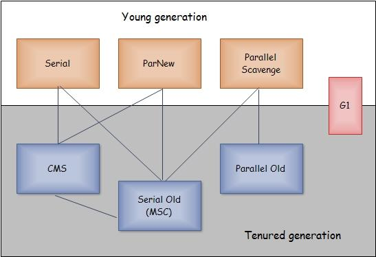
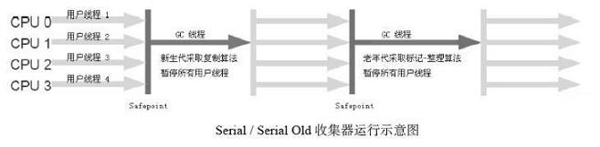
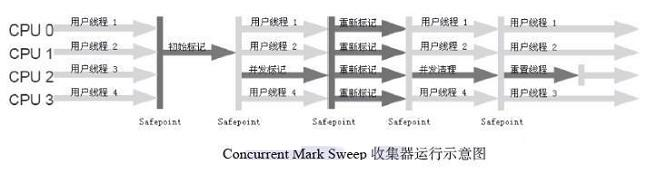
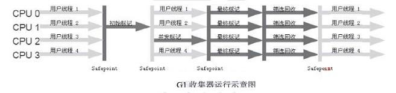

# 判断对象是否存活

## 引用计数

给对象中添加一个引用计数器，每当有一个地方引用它时，计数器就加一；当引用失效时，计数器就减一。当对象的引用计数器为0的时候对象就是不可能再被引用的。

**存在循环引用的问题**

```java
/**
 * @Class: ReferenceGCDemo
 * @Author: chaos
 * @Date: 2019/4/21 16:06
 * @Version 1.0
 *
 * VM Args: -XX:+PrintGCDetails -Xloggc:ReferenceGCDemo_gc.log
 * cmd: java -XX:+PrintGCDetails -Xloggc:ReferenceGCDemo_gc.log ReferenceGCDemo
 */
public class ReferenceGCDemo {

    public Object instance = null;

    // use some memory for the Object to see diff in GC log
    private static final int _1MB = 1024 *1024;
    private byte[] something = new byte[_1MB];

    public static void main(String[] args) {
        ReferenceGCDemo demo1 = new ReferenceGCDemo();
        ReferenceGCDemo demo2 = new ReferenceGCDemo();

        demo1.instance = demo2;
        demo2.instance = demo1;

        demo1 = null;
        // as one Object is not set to null, the both will not be recycled
        demo2 = null;

        System.gc();
    }
}
```

```java
Java HotSpot(TM) 64-Bit Server VM (25.202-b08) for windows-amd64 JRE (1.8.0_202-b08), built on Dec 15 2018 19:54:30 by "java_re" with MS VC++ 10.0 (VS2010)
Memory: 4k page, physical 16592564k(8567772k free), swap 19607220k(9681476k free)
CommandLine flags: -XX:InitialHeapSize=265481024 -XX:MaxHeapSize=4247696384 -XX:+PrintGC -XX:+PrintGCDetails -XX:+PrintGCTimeStamps -XX:+UseCompressedClassPointers -XX:+UseCompressedOops -XX:-UseLargePagesIndividualAllocation -XX:+UseParallelGC 
0.093: [GC (System.gc()) [PSYoungGen: 4649K->872K(75776K)] 4649K->880K(249344K), 0.0016694 secs] [Times: user=0.00 sys=0.00, real=0.00 secs] 
0.095: [Full GC (System.gc()) [PSYoungGen: 872K->0K(75776K)] [ParOldGen: 8K->627K(173568K)] 880K->627K(249344K), [Metaspace: 2633K->2633K(1056768K)], 0.0057150 secs] [Times: user=0.00 sys=0.00, real=0.01 secs] 
Heap
 PSYoungGen      total 75776K, used 650K [0x000000076b980000, 0x0000000770e00000, 0x00000007c0000000)
  eden space 65024K, 1% used [0x000000076b980000,0x000000076ba22a68,0x000000076f900000)
  from space 10752K, 0% used [0x000000076f900000,0x000000076f900000,0x0000000770380000)
  to   space 10752K, 0% used [0x0000000770380000,0x0000000770380000,0x0000000770e00000)
 ParOldGen       total 173568K, used 627K [0x00000006c2c00000, 0x00000006cd580000, 0x000000076b980000)
  object space 173568K, 0% used [0x00000006c2c00000,0x00000006c2c9cea8,0x00000006cd580000)
 Metaspace       used 2640K, capacity 4486K, committed 4864K, reserved 1056768K
  class space    used 282K, capacity 386K, committed 512K, reserved 1048576K
```

**[PSYoungGen: 4649K->872K(75776K)]** 表示新生代回收了这两个对象，即使它们由于互相引用而导致计数器不为0。

## 可达性分析

通过一系列被称为“GC ROOT”的对象作为起始点，从这些节点开始向下搜索。搜索走过的路径称为引用链（Reference Chain），当一个对象不在任何引用链上时，则证明这个对象不可用。

```java
/**
 * @Class: ReferenceGCDemo
 * @Author: chaos
 * @Date: 2019/4/21 16:06
 * @Version 1.0
 *
 * VM Args: -XX:+PrintGCDetails -Xloggc:ReferenceGCDemo_gc.log
 * cmd: java -XX:+PrintGCDetails -Xloggc:ReferenceGCDemo_gc.log ReferenceGCDemo
 */
public class ReferenceGCDemo {

    public Object instance = null;

    // use some memory for the Object to see diff in GC log
    private static final int _1MB = 1024 *1024;
    private byte[] something = new byte[_1MB];

    public static void main(String[] args) {
        ReferenceGCDemo demo1 = new ReferenceGCDemo();
        ReferenceGCDemo demo2 = new ReferenceGCDemo();

        demo1.instance = demo2;
        demo2.instance = demo1;

        demo1 = null;
        // as one Object is not set to null, the both will not be recycled
        // demo2 = null;

        System.gc();
    }
}
```

```java
Java HotSpot(TM) 64-Bit Server VM (25.202-b08) for windows-amd64 JRE (1.8.0_202-b08), built on Dec 15 2018 19:54:30 by "java_re" with MS VC++ 10.0 (VS2010)
Memory: 4k page, physical 16592564k(9074712k free), swap 19607220k(9077448k free)
CommandLine flags: -XX:InitialHeapSize=265481024 -XX:MaxHeapSize=4247696384 -XX:+PrintGC -XX:+PrintGCDetails -XX:+PrintGCTimeStamps -XX:+UseCompressedClassPointers -XX:+UseCompressedOops -XX:-UseLargePagesIndividualAllocation -XX:+UseParallelGC 
0.089: [GC (System.gc()) [PSYoungGen: 4649K->2904K(75776K)] 4649K->2912K(249344K), 0.0016002 secs] [Times: user=0.00 sys=0.00, real=0.00 secs] 
0.091: [Full GC (System.gc()) [PSYoungGen: 2904K->0K(75776K)] [ParOldGen: 8K->2675K(173568K)] 2912K->2675K(249344K), [Metaspace: 2633K->2633K(1056768K)], 0.0041223 secs] [Times: user=0.00 sys=0.00, real=0.00 secs] 
Heap
 PSYoungGen      total 75776K, used 650K [0x000000076b980000, 0x0000000770e00000, 0x00000007c0000000)
  eden space 65024K, 1% used [0x000000076b980000,0x000000076ba22a68,0x000000076f900000)
  from space 10752K, 0% used [0x000000076f900000,0x000000076f900000,0x0000000770380000)
  to   space 10752K, 0% used [0x0000000770380000,0x0000000770380000,0x0000000770e00000)
 ParOldGen       total 173568K, used 2675K [0x00000006c2c00000, 0x00000006cd580000, 0x000000076b980000)
  object space 173568K, 1% used [0x00000006c2c00000,0x00000006c2e9cef8,0x00000006cd580000)
 Metaspace       used 2640K, capacity 4486K, committed 4864K, reserved 1056768K
  class space    used 282K, capacity 386K, committed 512K, reserved 1048576K
```

**[PSYoungGen: 4649K->2904K(75776K)]** 表示新生代没有回收了这两个对象，即使有一个已经设为null。

## 四种引用

- 强引用：最长用的引用，只要引用还存在，垃圾回收器就不会回收被引用的对象。

  ```java
  ReferenceGCDemo demo1 = new ReferenceGCDemo();
  ```

  

- 软引用：描述一些还有用但是非必需的对象。在将要发生OOM之前，将会把这些对象列进回收范围之中进行第二次回收，如果回收后还是没有足够的内存，才会抛出OOM。

  ```java
  ReferenceQueue<ReferenceGCDemo> referenceQueue = new ReferenceQueue<>();
          SoftReference<ReferenceGCDemo> softReference = new SoftReference<>(new ReferenceGCDemo(), referenceQueue);
  ```

  

- 弱引用：描述非必需对象。一旦垃圾回收器开始工作，无论内存是否足够，都会回收只被弱引用的对象。

  ```java
  ReferenceQueue<ReferenceGCDemo> referenceQueue = new ReferenceQueue<>();
          WeakReference<ReferenceGCDemo> weakReference = new WeakReference<>(new ReferenceGCDemo(), referenceQueue);
  ```

  

- 虚引用：不会影响一个对象的生命周期，只是为了这个对象被回收时受到一个系统通知。

  ```java
  ReferenceQueue<ReferenceGCDemo> referenceQueue = new ReferenceQueue<>();
          PhantomReference<ReferenceGCDemo> phantomReference = new PhantomReference<>(new ReferenceGCDemo(), referenceQueue);
  ```

  

## 垂死挣扎的对象

在对象实例被回收之前，虚拟机会尝试执行其finalize方法，每个对象实例的此方法最多会执行一次。

### 作用

- 可以用来释放资源

- 可以在对象被回收之前拯救一次

### 注意事项

- Java语言规范并不保证finalize方法会被及时地执行、而且根本不会保证它们会被执行
- finalize方法可能会带来性能问题，因为JVM通常在单独的低优先级线程中完成finalize的执行
- finalize方法中，可将待回收对象赋值给GC Roots可达的对象引用，从而达到对象再生的目的
- finalize方法至多由GC执行一次

```java
/**
 * @Class: FinalizeDemo
 * @Author: chaos
 * @Date: 2019/4/21 17:12
 * @Version 1.0
 *
 * VM Args: -XX:+PrintGCDetails -Xloggc:ReferenceGCDemo_gc.log
 * cmd: java -XX:+PrintGCDetails -Xloggc:FinalizeDemo.log FinalizeDemo
 */
public class FinalizeDemo {

    // use some memory for the Object to see diff in GC log
    private static final int _50MB = 50 * 1024 *1024;
    private byte[] something = new byte[_50MB];

    public static FinalizeDemo SAVE_HOOK = null;

    @Override
    protected void finalize() throws Throwable {
        super.finalize();
        SAVE_HOOK = this;
    }

    public static void main(String[] args) throws Throwable {
        SAVE_HOOK = new FinalizeDemo();
        // SAVE_HOOK set to null for GC, but finalize() will run making the instance referenced to SAVE_HOOK
        SAVE_HOOK = null;
        System.gc();
        Thread.sleep(500);
        // SAVE_HOOK set to null for GC
        SAVE_HOOK = null;
        // finalize() only run once, this time, the instance is dead
        System.gc();
    }
}

```


```java
Java HotSpot(TM) 64-Bit Server VM (25.202-b08) for windows-amd64 JRE (1.8.0_202-b08), built on Dec 15 2018 19:54:30 by "java_re" with MS VC++ 10.0 (VS2010)
Memory: 4k page, physical 16592564k(8911672k free), swap 19607220k(8621968k free)
CommandLine flags: -XX:InitialHeapSize=265481024 -XX:MaxHeapSize=4247696384 -XX:+PrintGC -XX:+PrintGCDetails -XX:+PrintGCTimeStamps -XX:+UseCompressedClassPointers -XX:+UseCompressedOops -XX:-UseLargePagesIndividualAllocation -XX:+UseParallelGC 
0.120: [GC (System.gc()) [PSYoungGen: 53801K->856K(75776K)] 53801K->52064K(249344K), 0.0280681 secs] [Times: user=0.01 sys=0.00, real=0.03 secs] 
0.148: [Full GC (System.gc()) [PSYoungGen: 856K->0K(75776K)] [ParOldGen: 51208K->51827K(173568K)] 52064K->51827K(249344K), [Metaspace: 2633K->2633K(1056768K)], 0.0132851 secs] [Times: user=0.02 sys=0.00, real=0.01 secs] 
0.162: [GC (System.gc()) [PSYoungGen: 0K->0K(75776K)] 51827K->51827K(249344K), 0.0008370 secs] [Times: user=0.00 sys=0.00, real=0.00 secs] 
0.163: [Full GC (System.gc()) [PSYoungGen: 0K->0K(75776K)] [ParOldGen: 51827K->51827K(173568K)] 51827K->51827K(249344K), [Metaspace: 2633K->2633K(1056768K)], 0.0035211 secs] [Times: user=0.13 sys=0.00, real=0.00 secs] 
Heap
 PSYoungGen      total 75776K, used 650K [0x000000076b980000, 0x0000000770e00000, 0x00000007c0000000)
  eden space 65024K, 1% used [0x000000076b980000,0x000000076ba22a68,0x000000076f900000)
  from space 10752K, 0% used [0x0000000770380000,0x0000000770380000,0x0000000770e00000)
  to   space 10752K, 0% used [0x000000076f900000,0x000000076f900000,0x0000000770380000)
 ParOldGen       total 173568K, used 51827K [0x00000006c2c00000, 0x00000006cd580000, 0x000000076b980000)
  object space 173568K, 29% used [0x00000006c2c00000,0x00000006c5e9cfa8,0x00000006cd580000)
 Metaspace       used 2640K, capacity 4486K, committed 4864K, reserved 1056768K
  class space    used 282K, capacity 386K, committed 512K, reserved 1048576K
```

- 第一次GC

  ```java
  0.116: [GC (System.gc()) [PSYoungGen: 53801K->840K(75776K)] 53801K->52048K(249344K), 0.0283071 secs] [Times: user=0.03 sys=0.00, real=0.03 secs] 
  0.144: [Full GC (System.gc()) [PSYoungGen: 840K->0K(75776K)] [ParOldGen: 51208K->51827K(173568K)] 52048K->51827K(249344K), [Metaspace: 2633K->2633K(1056768K)], 0.0122119 secs] [Times: user=0.09 sys=0.02, real=0.01 secs] 
  说明instance从新生代去了老年代，没有被回收。
  ```

- 第二次GC

  ```java
  0.657: [GC (System.gc()) [PSYoungGen: 1269K->32K(75776K)] 53096K->51859K(249344K), 0.0019688 secs] [Times: user=0.00 sys=0.00, real=0.00 secs] 
  0.659: [Full GC (System.gc()) [PSYoungGen: 32K->0K(75776K)] [ParOldGen: 51827K->627K(173568K)] 51859K->627K(249344K), [Metaspace: 2634K->2634K(1056768K)], 0.0157303 secs] [Times: user=0.02 sys=0.00, real=0.02 secs] 
  说明instance从老年代被回收了。
  ```

  

**请慎重使用finalize方法，甚至一般不建议使用此方法，就当它不存在**。

## 回收方法区

方法区的垃圾回收主要回收两部分内容：废弃常量和无用的类。回收废弃常量与回收Java堆中的对象非常类似。以常量池中字面量的回收为例，假如一个字符串“abc”已经进入了常量池中，但是当前系统没有任何一个String对象是叫做“abc”的，换句话说是没有任何String对象引用常量池中的“abc”常量，也没有其他地方引用了这个字面量，如果在这时候发生内存回收，而且必要的话，这个“abc”常量就会被回收。常量池中的其他类（接口）、方法、字段的符号引用也与此类似。

判定一个常量是否是“废弃常量”比较简单，而要判定一个类是否是“无用的类”的条件则相对苛刻许多。类需要同时满足下面3个条件才能算是“无用的类”：

- 该类所有的实例都已经被回收，也就是Java堆中不存在该类的任何实例

- 加载该类的ClassLoader已经被回收

- 该类对应的java.lang.Class 对象没有在任何地方被引用，无法在任何地方通过反射访问该类的方法。

虚拟机可以对满足上述3个条件的无用类进行回收，这里说的仅仅是“可以”，而不是和对象一样，不使用了就必然会回收。

# 垃圾收集算法

## 标记-清除算法

直接将被回收的对象占用的内存区域标记为可用，供下次分配对象实例空间使用。


- 速度快
- 会产生内存碎片


## 复制算法

使用两块同样大小的内存区域。每次使用一块，回收时将存活的对象移动到另外一块区域并重新排列。


- 速度较快
- 需要浪费一半空间


## 标记-整理算法

在标记-清除算法的基础上，将对象实例全部往一个方向移动，使空闲的空间集中。


- 速度慢
- 空间利用率最高


# 分代收集

对于HotSpot虚拟机，采用了分代收集的算法。将堆内存区域分为两个大的部分：新生代和老年代。其中新生代又分为三个区：

- Eden
- Survivor From
- Survivor To

## 内存分配策略

- 对象优先在Eden区分配

- 大对象直接在老年代分配

- 长期存活的对象将进入老年代

## 新生代（Yong Generation）

新生代主要存放新创建的对象实例。新创建的对象实例往往很快就可以被回收掉（例如方法中生命的局部变量实例），垃圾收集的频率会比老年代更高。

仅在新生代执行的GC被称为Minor GC，触发条件为Eden区没有空间供分配给新对象实例使用。

Minor GC使用复制算法，流程如下：

1. 复制Eden区和Survivor From区存活对象至Survivor To区
2. 清空Eden区和Survivor From区
3. 将Survivor To区标记为Survivor From区，将Survivor From区标记为Survivor To区

## 老年代（Old Generation）

经过多次Minor GC依然存活的对象和新创建的“大”对象将进入老年区。老年区的垃圾收集频率不会太高。

老年代执行GC时一定会执行Full GC，Full GC的开销比Minor GC要大很多。

Full GC的触发条件：

1. 调用System.gc时，系统建议执行Full GC，但是不必然执行
2. 老年代空间不足
3. 方法区空间不足
4. 通过Minor GC后进入老年代的平均大小大于老年代的可用内存
5. 由Eden区、Survivor From区向Survivor To区复制时，对象大于Survivor To可用内存，则把该对象转存到老年代，且老年代的可用内存小于该对象大小

老年代使用标记-整理算法。

## 动态判断对象年龄

当对象实例经过了一次Minor GC还没有被回收，依然存在Survivor To区时，对象的“年龄”会加一。当对象的年龄到达一定界限时，会被转移到老年区。虚拟机会按照一定的规则动态的判断年龄的阈值，来决定多大“年龄”的对象实例可以进入老年区。

# 常用收集器



## Serial收集器

是一个**单线程**的收集器，但它的“单线程”的意义并不仅仅说明它只会使用一个CPU或一条收集线程去完成垃圾收集工作，更重要的是在它进行垃圾收集时，必须暂停其他所有的工作线程，直到它收集结束。简单而高效（与其他收集器的单线程比），对于限定单个CPU的环境来说，Serial收集器由于没有线程交互的开销，专心做垃圾收集自然可以获得最高的单线程收集效率。



## ParNew收集器

是Serial收集器的**多线程版本**，除了使用多条线程进行垃圾收集之外，其余行为包括Serial收集器可用的所有控制参数、收集算法、Stop The World、对象分配规则、回收策略等都与Serial收集器完全一样，在实现上，这两种收集器也共用了相当多的代码。

## Parallel Scavenge收集器

是一个**新生代收集器**，它也是使用**复制算法**的收集器，又是**并行**的多线程收集器。

## Serial Old收集器

是Serial收集器的**老年代版本**，它同样是一个**单线程收集器**，使用**标记－整理**算法。

## Parallel Old收集器

是Parallel Scavenge收集器的**老年代版本**，使用**多线程**和**“标记－整理”**算法。

## CMS收集器

CMS（Concurrent Mark Sweep）收集器是一种以获取最短回收停顿时间为目标的收集器。目前很大一部分的Java应用集中在互联网站或者B/S系统的服务端上，这类应用尤其重视服务的响应速度，希望系统停顿时间最短，以给用户带来较好的体验。CMS收集器就非常符合这类应用的需求。

CMS收集器是基于**“标记—清除”**算法实现的，它的运作过程相对于前面几种收集器来说更复杂一些，整个过程分为4个步骤：

- **初始标记（CMS initial mark）**
   初始标记仅仅只是标记一下GC Roots能直接关联到的对象，速度很快，需要“Stop The World”。
- **并发标记（CMS concurrent mark）**
   并发标记阶段就是进行GC Roots Tracing的过程。
- **重新标记（CMS remark）**
   重新标记阶段是为了修正并发标记期间因用户程序继续运作而导致标记产生变动的那一部分对象的标记记录，这个阶段的停顿时间一般会比初始标记阶段稍长一些，但远比并发标记的时间短，仍然需要“Stop The World”。
- **并发清除（CMS concurrent sweep）**
   并发清除阶段会清除对象。



## G1收集器（Garbage-First）

G1（Garbage-First）是一款面向**服务端应用**的垃圾收集器。HotSpot开发团队赋予它的使命是未来可以替换掉JDK 1.5中发布的CMS收集器。与其他GC收集器相比，G1具备如下特点：

- **并行与并发**
   G1能充分利用多CPU、多核环境下的硬件优势，使用多个CPU来缩短Stop-The-World停顿的时间，部分其他收集器原本需要停顿Java线程执行的GC动作，G1收集器仍然可以通过并发的方式让Java程序继续执行。
- **分代收集**
   与其他收集器一样，分代概念在G1中依然得以保留。虽然G1可以不需要其他收集器配合就能独立管理整个GC堆，但它能够采用不同的方式去处理新创建的对象和已经存活了一段时间、熬过多次GC的旧对象以获取更好的收集效果。
- **空间整合**
   与CMS的“标记—清理”算法不同，G1从**整体来看是基于“标记—整理”**算法实现的收集器，从**局部（两个Region之间）上来看是基于“复制”**算法实现的，但无论如何，这两种算法都意味着G1运作期间不会产生内存空间碎片，收集后能提供规整的可用内存。这种特性有利于程序长时间运行，分配大对象时不会因为无法找到连续内存空间而提前触发下一次GC。
- **可预测的停顿**
   这是G1相对于CMS的另一大优势，降低停顿时间是G1和CMS共同的关注点，但G1除了追求低停顿外，还能建立可预测的停顿时间模型，能让使用者明确指定在一个长度为M毫秒的时间片段内，消耗在垃圾收集上的时间不得超过N毫秒。

在G1之前的其他收集器进行收集的范围都是整个新生代或者老年代，而G1不再是这样。使用G1收集器时，Java堆的内存布局就与其他收集器有很大差别，它将整个Java堆划分为多个大小相等的独立区域（Region），虽然还保留有新生代和老年代的概念，但新生代和老年代不再是物理隔离的了，它们都是一部分Region（不需要连续）的集合。

G1收集器之所以能建立可预测的停顿时间模型，是因为它可以有计划地避免在整个Java堆中进行全区域的垃圾收集。G1跟踪各个Region里面的垃圾堆积的价值大小（回收所获得的空间大小以及回收所需时间的经验值），在后台维护一个优先列表，每次根据允许的收集时间，优先回收价值最大的Region（这也就是Garbage-First名称的来由）。这种使用Region划分内存空间以及有优先级的区域回收方式，保证了G1收集器在有限的时间内可以获取尽可能高的收集效率。

**执行过程：**
 G1收集器的运作大致可划分为以下几个步骤：

- **初始标记（Initial Marking）**
   初始标记阶段仅仅只是标记一下GC Roots能直接关联到的对象，并且修改TAMS（Next Top at Mark Start）的值，让下一阶段用户程序并发运行时，能在正确可用的Region中创建新对象，这阶段需要停顿线程，但耗时很短。
- **并发标记（Concurrent Marking）**
   并发标记阶段是从GC Root开始对堆中对象进行可达性分析，找出存活的对象，这阶段耗时较长，但可与用户程序并发执行。
- **最终标记（Final Marking）**
   最终标记阶段是为了修正在并发标记期间因用户程序继续运作而导致标记产生变动的那一部分标记记录，虚拟机将这段时间对象变化记录在线程`Remembered Set Logs`里面，最终标记阶段需要把`Remembered Set Logs`的数据合并到`Remembered Set`中，这阶段需要停顿线程，但是可并行执行。
- **筛选回收（Live Data Counting and Evacuation）**
   筛选回收阶段首先对各个Region的回收价值和成本进行排序，根据用户所期望的GC停顿时间来制定回收计划，这个阶段其实也可以做到与用户程序一起并发执行，但是因为只回收一部分Region，时间是用户可控制的，而且停顿用户线程将大幅提高收集效率。



# GC日志

## 输出日志

- -XX:+PrintGC 输出GC日志

- -XX:+PrintGCDetails 输出GC的详细日志

- -XX:+PrintGCTimeStamps 输出GC的时间戳（以基准时间的形式）

- -XX:+PrintGCDateStamps 输出GC的时间戳（以日期的形式，如 2013-05-04T21:53:59.234+0800）

- -XX:+PrintHeapAtGC 在进行GC的前后打印出堆的信息

- -Xloggc:../logs/gc.log 日志文件的输出路径

## 理解日志

```java
// Java基本信息
Java HotSpot(TM) 64-Bit Server VM (25.202-b08) for windows-amd64 JRE (1.8.0_202-b08), built on Dec 15 2018 19:54:30 by "java_re" with MS VC++ 10.0 (VS2010)
// 系统内存情况
Memory: 4k page, physical 16592564k(8792256k free), swap 19607220k(8499336k free)
// 命令行启动参数，有些是默认的
CommandLine flags: -XX:InitialHeapSize=265481024 -XX:MaxHeapSize=4247696384 -XX:+PrintGC -XX:+PrintGCDateStamps -XX:+PrintGCDetails -XX:+PrintGCTimeStamps -XX:+UseCompressedClassPointers -XX:+UseCompressedOops -XX:-UseLargePagesIndividualAllocation -XX:+UseParallelGC 
// 2019-04-23T11:41:02.230+0800：当前执行时间
// 0.149：程序启动后的时间戳
// GC：表示执行了一次Minor GC
// PSYoungGen：表示新生代使用的是多线程垃圾收集器Parallel Scavenge
// 53801K->856K(75776K)：53801K（新生代垃圾回收前使用大小），856K（回收后使用大小），75776K（新生代总大小）
// 53801K->52064K(249344K), 0.0414986 secs：53801K（整个堆回收前使用大小）->52064K（回收后使用大小）(249344K（堆总大小），0.0414986 secs（本次回收使用的时间）
// [Times: user=0.02 sys=0.03, real=0.04 secs]：user=0.02（用户耗时），sys=0.03（系统耗时），real=0.04 secs（实际耗时）
2019-04-23T11:41:02.230+0800: 0.149: [GC (System.gc()) [PSYoungGen: 53801K->856K(75776K)] 53801K->52064K(249344K), 0.0414986 secs] [Times: user=0.02 sys=0.03, real=0.04 secs] 
// Full GC：表示执行了一次Full GC
// ParOldGen：表示老年代使用的是多线程垃圾收集器Parallel Scavenge
// 51208K->51827K(173568K)：51208K（老年代垃圾回收前使用大小），51827K（回收后使用大小），173568K（老年代总大小）
// Metaspace：表示回收了方法区
// 2633K->2633K(1056768K)：2633K（方法区垃圾回收前使用大小），2633K（回收后使用大小），1056768K（方法区总大小）
2019-04-23T11:41:02.272+0800: 0.191: [Full GC (System.gc()) [PSYoungGen: 856K->0K(75776K)] [ParOldGen: 51208K->51827K(173568K)] 52064K->51827K(249344K), [Metaspace: 2633K->2633K(1056768K)], 0.0156533 secs] [Times: user=0.08 sys=0.00, real=0.02 secs] 
Heap
 PSYoungGen      total 75776K, used 1300K [0x000000076b980000, 0x0000000770e00000, 0x00000007c0000000)
  eden space 65024K, 2% used [0x000000076b980000,0x000000076bac5360,0x000000076f900000)
  from space 10752K, 0% used [0x0000000770380000,0x0000000770380000,0x0000000770e00000)
  to   space 10752K, 0% used [0x000000076f900000,0x000000076f900000,0x0000000770380000)
 ParOldGen       total 173568K, used 627K [0x00000006c2c00000, 0x00000006cd580000, 0x000000076b980000)
  object space 173568K, 0% used [0x00000006c2c00000,0x00000006c2c9cc58,0x00000006cd580000)
 Metaspace       used 2640K, capacity 4486K, committed 4864K, reserved 1056768K
  class space    used 282K, capacity 386K, committed 512K, reserved 1048576K
```


