# JDK命令行工具

## jps：虚拟机进程状况工具

查看Java虚拟机进程的工具，可以输出Java虚拟机进程的LVMID（Local Virtual Machine Identifier）。

### 命令样式

jps [ options ] [ hostid ]

### 主要选项

- -q：只输出LVMID，省略主类的名称
- -m：输出虚拟机进程时传递给main（）函数的参数
- -l：输出主类的全名，如果是Jar包，输出Jar包名称
- -v：输出虚拟机进程启动时JVM参数

### 示例

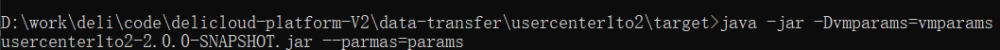

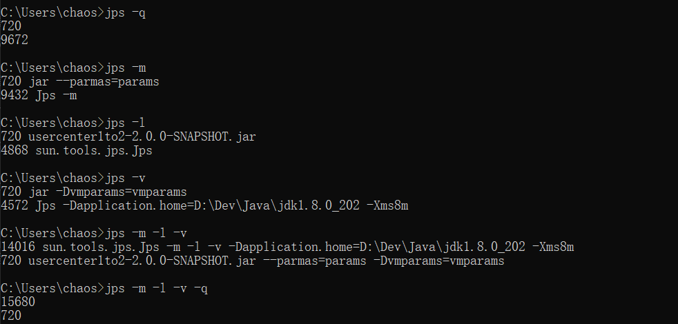

## jstat：虚拟机统计信息监控工具

用于监控虚拟机各种运行状态信息的工具，可以显示本地或远程虚拟机进程中的类装载、内存、垃圾收集、JIT编译等运行数据。

### 命令样式

jstat [ options vmid [interval[s|ms] [count]] ]

### 主要选项

- -class：监视类装载、卸载数量、总空间以及类装载消耗的时间

  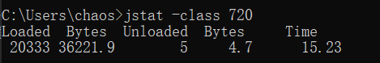

- -gc:监视Java堆状况

  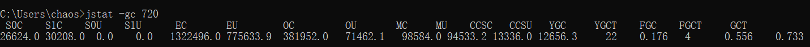

- -gccapacity：与-gc基本相同，但是主要关注堆里各个区域使用到的最大、最小空间

  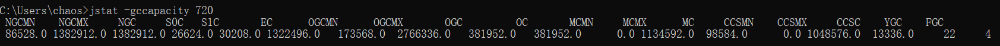

- -gcutil：与-gc基本相同，但是主要关注已使用空间占总空间的比例

- -gccause：与-gcutil一样，但是会输出上一次gc产生的原因

- -gcnew：监视新生代gc状况

- -gcnewcapacity：与-gcnew基本相同，但是主要关注使用到的最大、最小空间

- -gcold：监视老年代gc状况

- -gcoldcapacity：与-gcold基本相同，但是主要关注使用到的最大、最小空间

- -compiler：输出JIT编译器编译过的方法、耗时等信息

  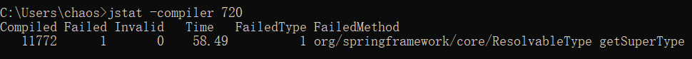

- -printcompilation：输出被JIT编译的方法

  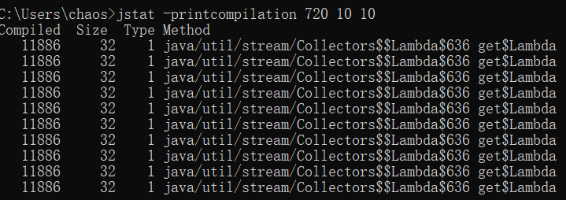

## jinfo：Java配置信息工具

实时查看和调整虚拟机各项参数。

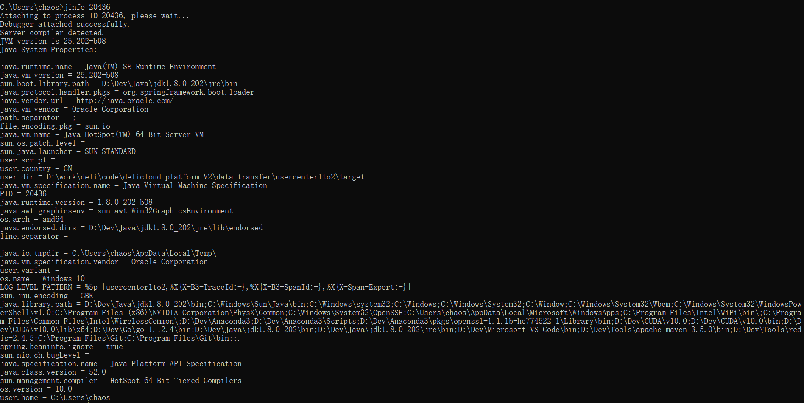

### 命令样式

- jinfo [ options ] pid
- jinfo [option] <executable <core>
- jinfo [option] [server_id@]<remote server IP or hostname>

### 主要选项

- -flag <name>: to print the value of the named VM flag
- -flag [+|-]<name>: to enable or disable the named VM flag
- -flag <name>=<value>: to set the named VM flag to the given value
- -flags: to print VM flags
- -sysprops: to print Java system properties
- <no option>: to print both of the above

## jmap：Java内存映像工具

用于生成内存存储快照。

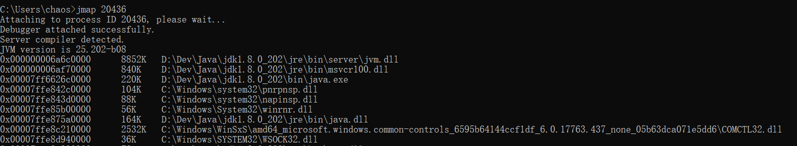

### 命令样式

- jmap [option] <pid>
- jmap [option] <executable <core>
-  jmap [option] [server_id@]<remote server IP or hostname>

### 主要选项

- <none>：打印全局概况
- -heap：打印堆内存概况

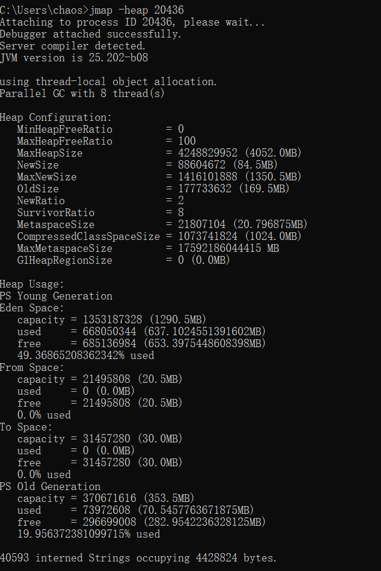

- -histo[:live]：打印堆中对象实例的统计情况，加上:live只统计存活的对象实例

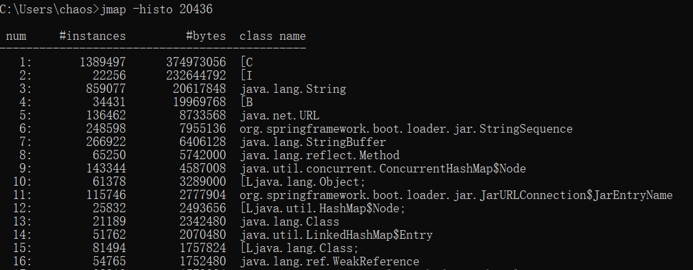

- -clstats：统计classload使用情况

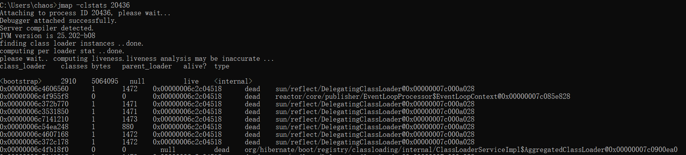

- -finalizerinfo：统计等待被回收的对象数量       to print information on objects awaiting finalization

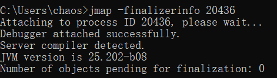

- -dump:<dump-options>：转存堆快照，选项如下，都是必填：
  - live：只转存存活的对象实例，如果没有指定就转存所有对象实例
  - format=b：使用二级制格式
  - file=<file>：转存文件地址

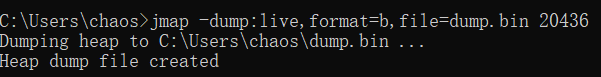

## jhat：虚拟机堆转储快照分析工具

搭配jmap，可视化分析jmap生成的堆转存文件.

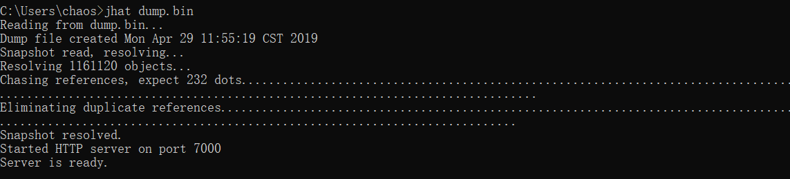

可以从自带的简单http服务器查看结果。

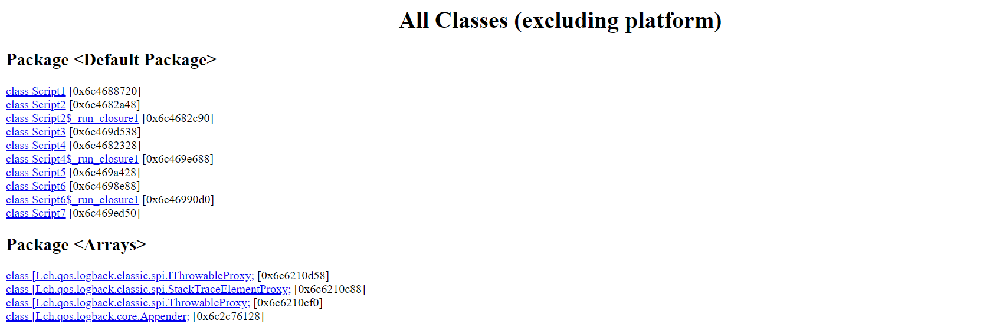

可以通过Show heap histogram来查看实例对象数目排行。

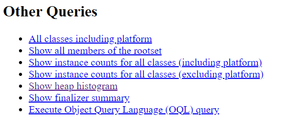

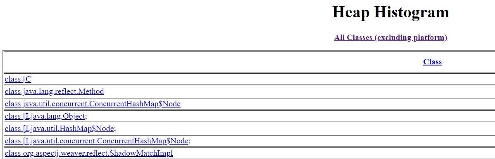

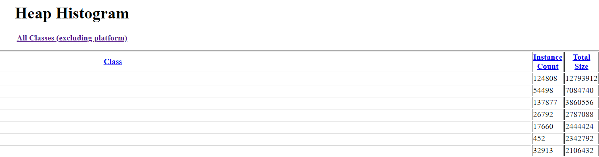

## jstack：Java堆栈跟踪工具

用户生成虚拟机当前时刻的线程快照。

### 命令样式

jstack [ option ] vmid

### 主要选项

- -F：强制进行输出，即使进程挂起了也输出
- -m：同时输出java堆栈和native调用堆栈
- -l：额外输出锁对象的相关信息 

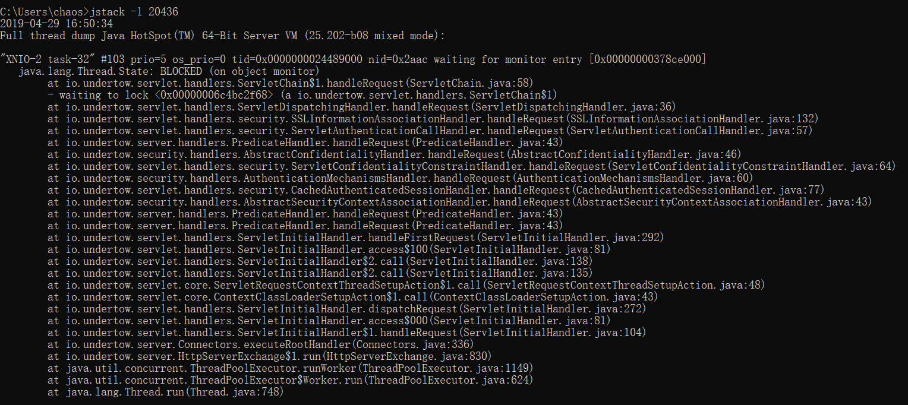

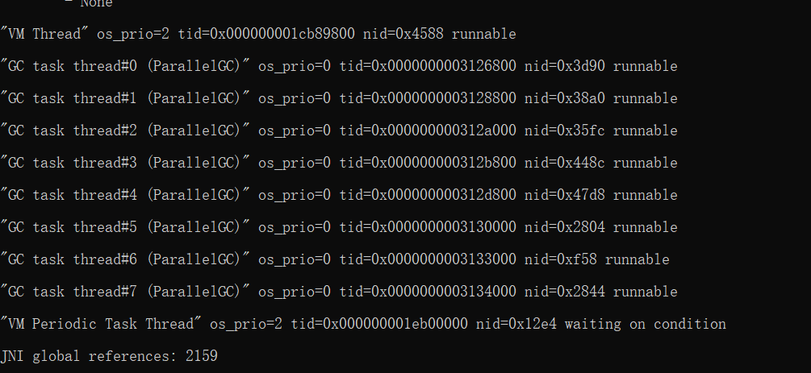

# JDK可视化工具

## JConsole：Java监视与管理控制台

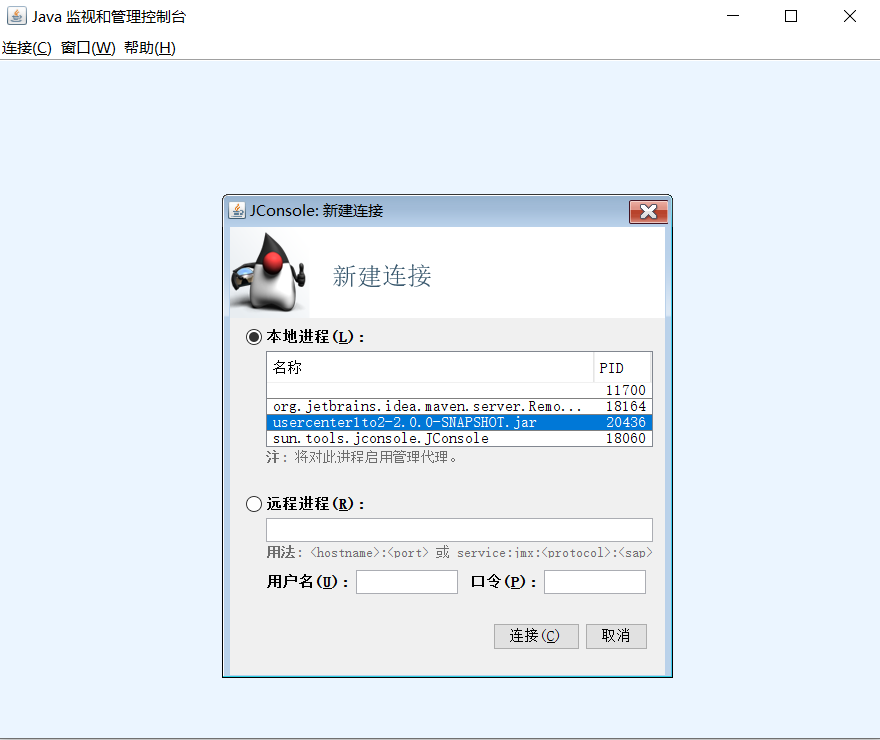

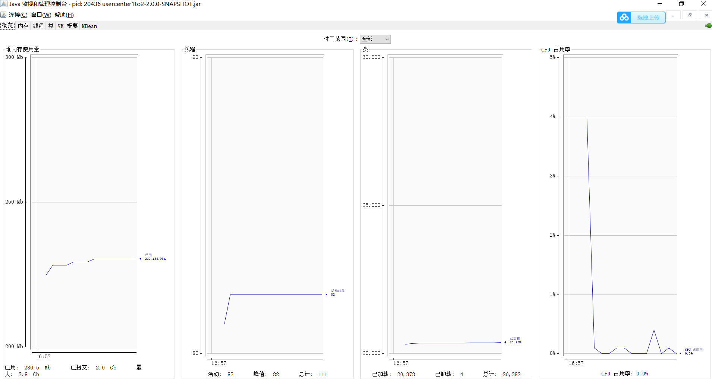

### 监控内存

使用“内存”标签页相当于可视化的jstat命令，用于监控虚拟机内存使用变化趋势。

```java
import java.util.LinkedList;
import java.util.List;

/**
 * @Class: MemoryDemo
 * @Author: chaos
 * @Date: 2019/4/27 14:20
 * @Version 1.0
 */
public class MemoryDemo {

    private byte[] bytes = new byte[64 * 1024];

    public static void main(String[] args) throws Exception {
        Thread.sleep(30 * 1000);
        List<MemoryDemo> list = new LinkedList<>();
        for (int i = 0; i < 1000; i++) {
            list.add(new MemoryDemo());
            Thread.sleep(50);
        }
        System.gc();
    }
}
```

#### 堆整体使用

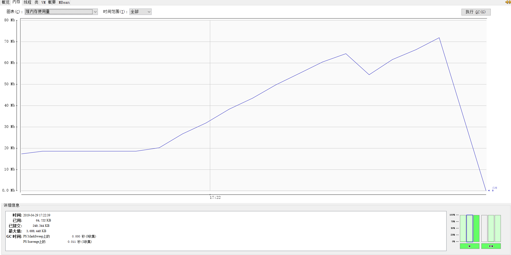

#### Eden

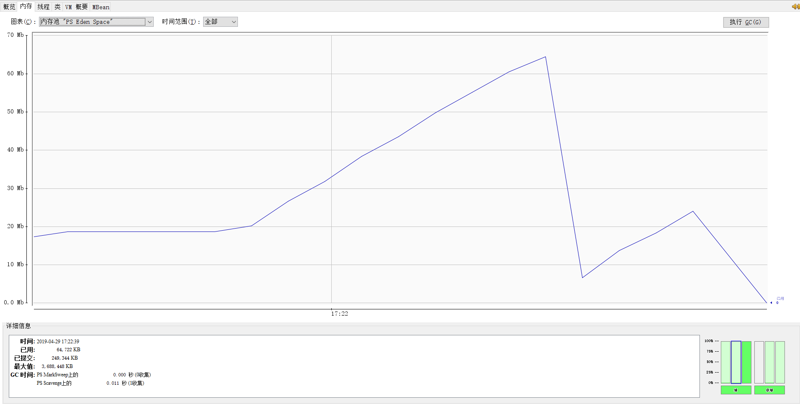

#### Survivor

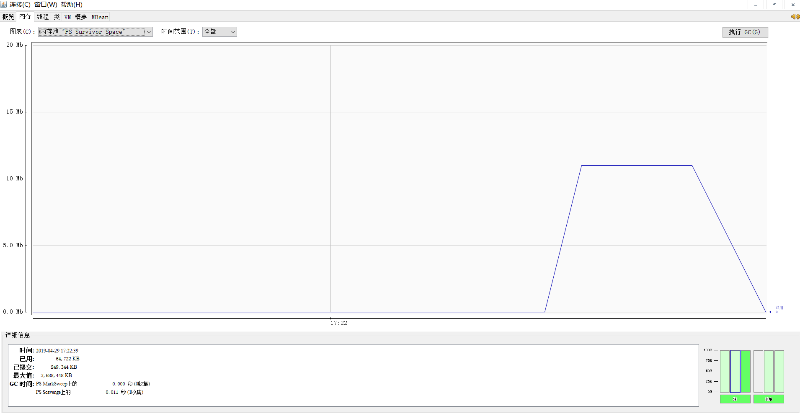

#### PS OLD GEN

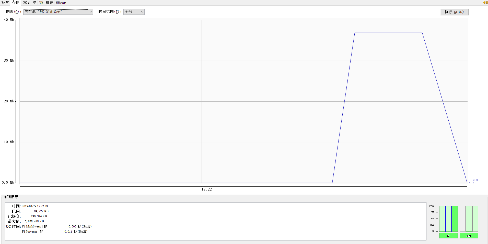

#### Metaspace

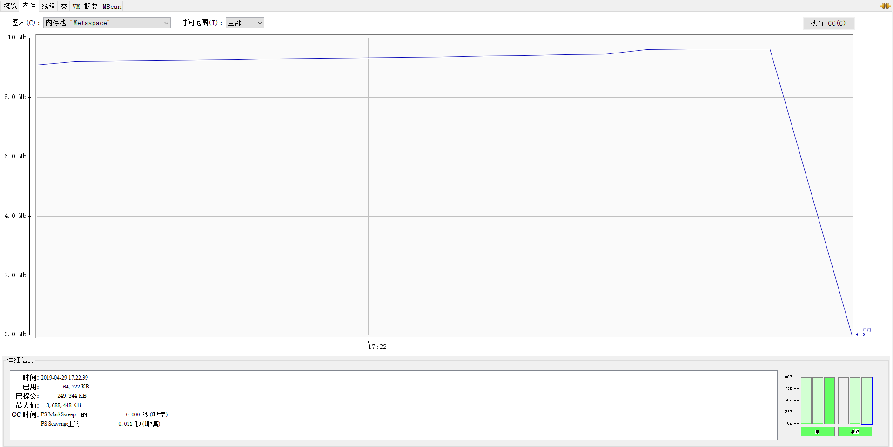

#### Code Cache

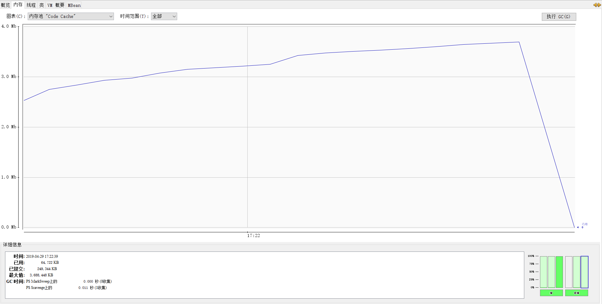

#### Compress Class Space

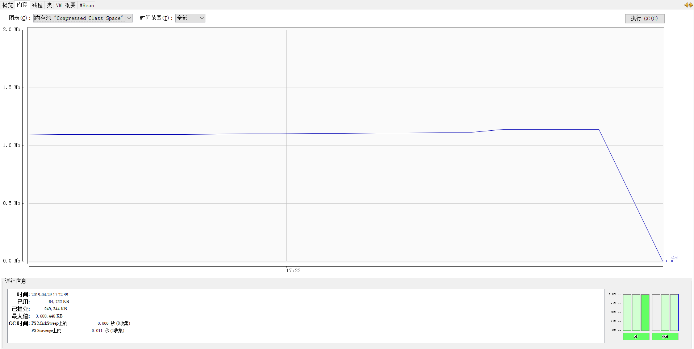

### 监控线程

Java线程的状态：

```java
public enum State {
        /**
         * Thread state for a thread which has not yet started.
         */
        NEW,

        /**
         * Thread state for a runnable thread.  A thread in the runnable
         * state is executing in the Java virtual machine but it may
         * be waiting for other resources from the operating system
         * such as processor.
         */
        RUNNABLE,

        /**
         * Thread state for a thread blocked waiting for a monitor lock.
         * A thread in the blocked state is waiting for a monitor lock
         * to enter a synchronized block/method or
         * reenter a synchronized block/method after calling
         * {@link Object#wait() Object.wait}.
         */
        BLOCKED,

        /**
         * Thread state for a waiting thread.
         * A thread is in the waiting state due to calling one of the
         * following methods:
         * <ul>
         *   <li>{@link Object#wait() Object.wait} with no timeout</li>
         *   <li>{@link #join() Thread.join} with no timeout</li>
         *   <li>{@link LockSupport#park() LockSupport.park}</li>
         * </ul>
         *
         * <p>A thread in the waiting state is waiting for another thread to
         * perform a particular action.
         *
         * For example, a thread that has called <tt>Object.wait()</tt>
         * on an object is waiting for another thread to call
         * <tt>Object.notify()</tt> or <tt>Object.notifyAll()</tt> on
         * that object. A thread that has called <tt>Thread.join()</tt>
         * is waiting for a specified thread to terminate.
         */
        WAITING,

        /**
         * Thread state for a waiting thread with a specified waiting time.
         * A thread is in the timed waiting state due to calling one of
         * the following methods with a specified positive waiting time:
         * <ul>
         *   <li>{@link #sleep Thread.sleep}</li>
         *   <li>{@link Object#wait(long) Object.wait} with timeout</li>
         *   <li>{@link #join(long) Thread.join} with timeout</li>
         *   <li>{@link LockSupport#parkNanos LockSupport.parkNanos}</li>
         *   <li>{@link LockSupport#parkUntil LockSupport.parkUntil}</li>
         * </ul>
         */
        TIMED_WAITING,

        /**
         * Thread state for a terminated thread.
         * The thread has completed execution.
         */
        TERMINATED;
    }
```


```java
/**
 * @Class: ThreadDemo
 * @Author: chaos
 * @Date: 2019/4/27 17:46
 * @Version 1.0
 */
public class ThreadDemo {

    private static final String lock1 = "lock1";
    private static final String lock2 = "lock2";
    private static final String lock3 = "lock3";

    public void busyThread() {
        new Thread(() -> {
            while (true) {}
        }, "busy_thread").start();
    }

    public void waitThread() {
        new Thread(() -> {
            synchronized (lock1) {
                try {
                    lock1.wait();
                } catch (Exception e) {}
            }
        }, "wait_thread").start();
    }

    public void deadLockThread () {
        new Thread(() -> {
            synchronized (lock2) {
                try {
                    Thread.sleep(500);
                    synchronized (lock3) {

                    }
                } catch (Exception e) {}
            }
        }, "dead_lock_thread1").start();

        new Thread(() -> {
            synchronized (lock3) {
                try {
                    Thread.sleep(500);
                    synchronized (lock2) {

                    }
                } catch (Exception e) {}
            }
        }, "dead_lock_thread2").start();
    }

    public static void main(String[] args) {
        ThreadDemo demo = new ThreadDemo();
        demo.busyThread();
        demo.waitThread();
        demo.deadLockThread();
    }

}
```


#### 监控死锁

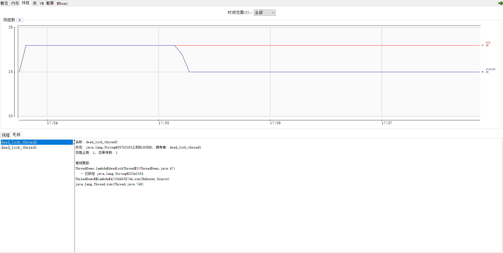

#### 监控等待线程

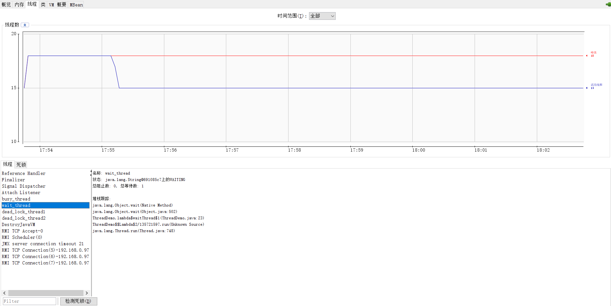

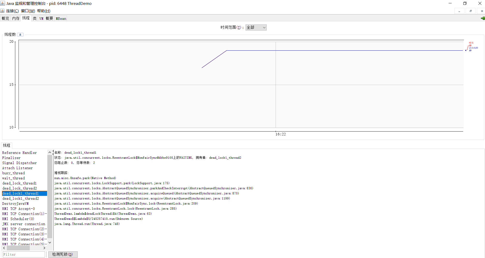

#### 监控阻塞线程

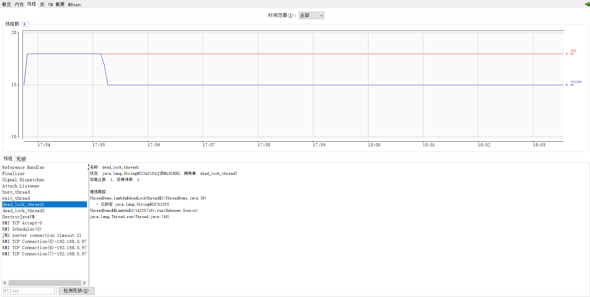

#### 监控执行线程

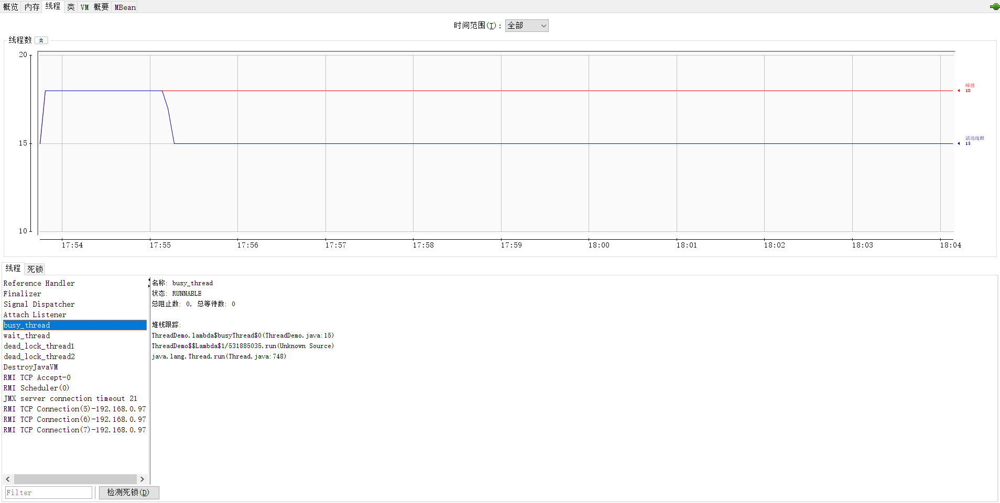

## jVisualVM：多合一故障处理工具

牛逼的工具，通过插件可以在UI界面整合之前的所有工具。

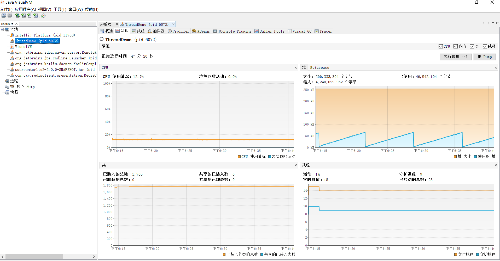

# 外部工具

## Eclipse Memory Analyzer：可视化内存分析Eclipse插件

直接分析jmap命令生成的转存文件，提供多种分析报告来帮助分析内存使用情况。

下载地址：<https://www.eclipse.org/mat/downloads.php>

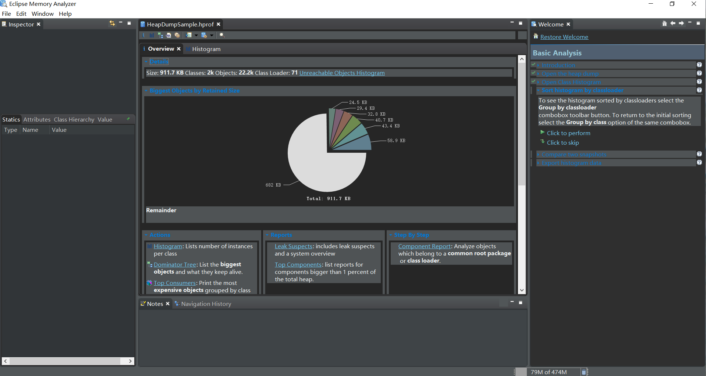

## 重要概念

- Shallow Size：是对象本身占据的内存的大小，不包含其引用的对象。对于常规对象（非数组）的Shallow Size由其成员变量的数量和类型来定，而数组的ShallowSize由数组类型和数组长度来决定，它为数组元素大小的总和。
- Retained Size：Retained Size=当前对象大小+当前对象可直接或间接引用到的对象的大小总和。(间接引用的含义：A->B->C,C就是间接引用) ，并且排除被GC Roots直接或者间接引用的对象。

**换句话说，Retained Size就是当前对象被GC后，从Heap上总共能释放掉的内存。**

## 使用教程

可以使用res目录下的example_code项目中的MatDemo.java源代码编译后执行，使用jmap命令转存快照文件尝试分析。

请参考：

- <https://www.cnblogs.com/trust-freedom/p/6744948.html>
- <https://help.eclipse.org/2019-03/index.jsp?topic=/org.eclipse.mat.ui.help/welcome.html>