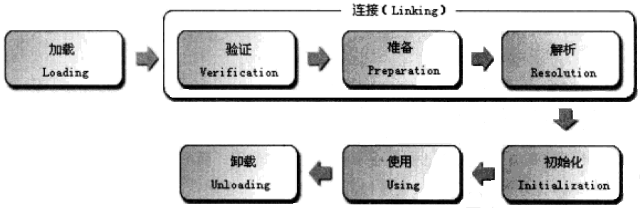
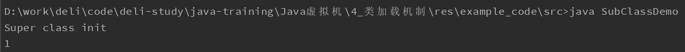
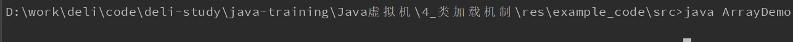
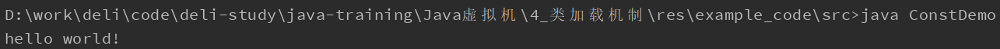
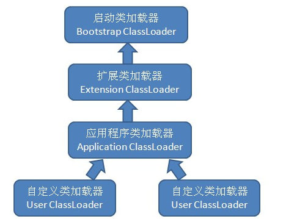

虚拟机把描述类的数据从Class文件加载到内存，并对数据进行校验、转换解析和初始化，最终形成可以被虚拟机直接使用的Java类型，这就是虚拟机的类加载机制。

# 虚拟机类加载

1. 加载（Loading）
2. 验证（Verification）
3. 准备（Preparation）
4. 解析（Resolution）
5. 初始化（Initialization）
6. 使用（Using）
7. 卸载（Unloading）

其中验证、准备和解析三个阶段又被统称为连接（Linking）。



加载、验证、准备、初始化和卸载这5个阶段的顺序是确定的，必须按部就班的开始。为了支持Java语言的运行时绑定，解析阶段在某些情况下可以在初始化阶段之后再开始。各个阶段的“开始”是确定的，但是“完成”是不确定的，因为各个阶段通常是互相交叉地混合进行，在一个阶段的执行过程中回调用、激活另外一个阶段。

## 类加载触发条件

虚拟机规范规定了有且只有5种情况必须立即对类执行初始化（加载、验证、准备必须在初始化之前开始）：

1. 实例化对象、读取或设置一个类的类变量或调用一个类的静态方法
2. 对类进行反射调用的时候，如果类没有进行过初始化，则先要触发初始化
3. 当初始化一个类的时候，发现其父类还没有进行初始化，则需要触发其父类的初始化
4. 虚拟机启动时，执行的主类（包含启动的main()方法的那个类），需要初始化
5. 使用动态语言支持时，动态语言调用句柄对应的类没有进行过初始化，则需要先触发初始化

## 被动引用

### 通过子类使用父类的类变量

```java
/**
 * @Class: SubClassDemo
 * @Author: chaos
 * @Date: 2019/5/11 9:51
 * @Version 1.0
 */

class SuperClass {

    public static int value = 1;

    static {
        System.out.println("Super class init");
    }

}

class SubClass extends SuperClass{

    static {
        System.out.println("Sub class init");
    }
}

public class SubClassDemo extends SuperClass{

    public static void main(String[] args) {
        System.out.println(SubClass.value);
    }
} 
```



在使用类变量时，只有定义此变量的类才会被初始化。因此通过子类的继承来使用父类的类变量时，只会初始化父类而不会触发子类的初始化。至于是否要触发子类的加载和验证过程，各个虚拟机的实现不一致。

### 初始化数组

```java
/**
 * @Class: ArrayDemo
 * @Author: chaos
 * @Date: 2019/5/11 10:07
 * @Version 1.0
 */
public class ArrayDemo {

    public static void main(String[] args) {
        SuperClass[] array = new SuperClass[1];
    }
}
```



初始化一个数组时，不会初始化数组元素的类。但是虚拟机会初始化一个自动生成的类，这个类代表这个数组，提供数组的length属性和clone()方法。

### 使用常量

```java
/**
 * @Class: ConstDemo
 * @Author: chaos
 * @Date: 2019/5/11 10:16
 * @Version 1.0
 */
class ConstValue {

    static {
        System.out.println("Const value init");
    }

    public static final String HELLO_WORLD = "hello world!";
}

public class ConstDemo {

    public static void main(String[] args) {
        System.out.println(ConstValue.HELLO_WORLD);
    }
}
```



直接使用常量时，因为常量已经在编辑阶段通过常量传播优化存储到了ConstDemo的常量池中。在ConstDemo引用常量的过程中已经不需要ConstValue类的符号引用入口，这两个类在编译后已经不存在联系。

# 类加载过程解析

Java虚拟机中类加载的全过程，也就是加载、验证、准备、解析和初始话这5个阶段所执行的具体动作。

## 加载

在加载阶段，虚拟机需要完成以下3件事：

1. 通过一个类的全限定名来获取定义此类的二进制字节流
2. 将这个字节流转化为方法区的运行时数据结构
3. 在内存中生成一个代表这个类的java.lang.Class对象，作为方法区这个类的各种数据的访问入口

## 验证

验证时连接阶段的第一步，目的时为了确保Class文件的字节流中包含的信息符合当前虚拟机的要求。

验证阶段大致会完成下面4个阶段的检验动作：

1. 文件格式验证：确保字节流符合Class文件格式的规范，并且能被当前版本的虚拟机处理
2. 元数据验证：对类的元数据信息进行语义校验，保证不存在不符合Java语言规范的元数据信息
3. 字节码验证：通过对类的方法体（数据流和控制流）进行校验分析，确认程序语义是合法的、符合逻辑的
4. 符号引用验证：确保后续的解析动作能够正确执行，检查类的各种引用是否正确

## 准备

正式为类变量分配内存并设置类变量初始值的阶段，类变量都将在方法区中分配内存。

- 类变量：被static修饰的变量，被所有类的实例共享
- 实例变量：在对象实例化时随着对象一起分配在Java堆中，每个类实例独享

```java
public static int value = 123;
// 此代码在经过准备阶段以后，value的值为0，而不是123。
// 因为准备阶段只分配内存并设置初始值，int的初始值是0，实际的赋值操作在初始化阶段执行
```

## 解析 

虚拟机将常量池内的符号引用替换为直接引用的过程。

- 符号引用（Symbolic Reference）：符号引用以一组符号来描述引用的目标，与虚拟机实现的内存布局无关，甚至引用的目标并不一定已经加载到内存中，
- 直接引用（Direct Reference）：直接应用可以是指向目标的指针、相对偏移量或是一个能间接定位到目标的句柄。直接引用是和虚拟机实现的内存布局相关的，如果有了直接引用，那么引用的目标必定已经在内存中存在。

***例如有一个字符串常量，在经过解析阶段之前，只以符号引用的形式存在加载阶段生成的运行时数据结构中；经过解析阶段之后，生成了String对象，符号引用转换为直接引用。***

### 类或接口解析

当前代码所处的类为D，如果把一个从未解析过的符号引用N解析为一个类或接口C的直接应用，虚拟机需要完成以下3件事：

1. 如果C不是一个数组类型，那么虚拟机会把代表N的全限定名传递给D的类加载器去加载C。由于C的类加载过程，又可能触发其他类的类加载过程。一旦这个加载过程中出现了任何异常，解析过程宣告失败。
2. 如果C是数组类型，并且数据的元素类型为对象，虚拟机会按照第1点的过程进行元素类型的类加载过程。接着由虚拟机生成一个代表此数组维度和元素的数组对象。
3. 经过上面的步骤没有出现异常，那么C在虚拟机中世纪上已经成为了一个有效的类或接口。但在解析完成之前还要进行符号引用验证，确认D对C具备访问权限。

### 字段解析

要解析一个未被解析过的字段符号引用，首先要对字段所属的类或接口的符号引用进行解析。如果解析成功，那将这个字段所属的类或接口用C表示，虚拟机规范要求按照如下步骤对C进行后续字段的查找：

1. 如果C本身就包含了简单名称和字段描述符都与目标匹配的字段，则返回这个字段，查找结束。
2. 否则，如果在C中实现了接口，将会按照继承关系从下往上递归搜索各个接口和它的父接口，如果接口中包含了简单名称和字段描述符都与目标匹配的字段，则返回这个字段，查找结束。
3. 否则，如果C不是java.lang.Object的话，将会按照继承关系从下往上搜索其父类，如果父类中包含了简单名称和字段描述符都与目标匹配的字段，则返回这个字段，查找结束。
4. 否则，查找失败，抛出异常。

如果查找成功，还需要对这个字段进行权限验证。

### 类方法解析

类方法解析的第一个步骤与字段解析一样，需要先对方法所属的类或接口的符号引用进行解析。如果解析成功，那将这个字段所属的类或接口用C表示，虚拟机规范要求按照如下步骤对C进行后续类方法的查找：

1. 类方法和接口方法符号引用的常量类型定义是分开的，如果发现C是一个接口，直接抛出异常。
2. 如果通过第1步，如果C本身就包含了简单名称和字段描述符都与目标匹配的方法，则返回这个字段，查找结束。
3. 否则，在C的父类中递归查找，如果父类中包含了简单名称和字段描述符都与目标匹配的字段，则返回这个字段，查找结束。
4. 否则，在C实现的接口列表及它们的父接口中递归查找，如果存在匹配的方法，说明C是一个抽象类，查找结束，抛出异常。
5. 否则，查找失败，抛出异常。

### 接口方法解析

接口方法解析的第一个步骤与字段解析一样，需要先对方法所属的类或接口的符号引用进行解析。如果解析成功，那将这个字段所属的类或接口用C表示，虚拟机规范要求按照如下步骤对C进行后续接口方法的查找：

1. 类方法和接口方法符号引用的常量类型定义是分开的，如果发现C是一个类，直接抛出异常。
2. 如果通过第1步，如果C本身就包含了简单名称和字段描述符都与目标匹配的方法，则返回这个字段，查找结束。
3. 否则，在C的父接口中递归查找，知道java.lang.Object类（包括），如果父接口包含了简单名称和字段描述符都与目标匹配的方法，则返回这个字段，查找结束。
4. 否则，查找失败，抛出异常。

## 初始化

初始化是类加载过程的最后一步，到了初始化阶段，才真正开始执行类中定义的Java程序代码。

初始化是执行类构造器\<client>()方法的过程：

1. \<client>()方法是由编译器自动收集类中的所有类变量赋值动作和静态语句块（static{}块）中语句合并产生的。***静态语句块可以访问和赋值定义在静态语句块之前的变量；静态语句块可以赋值但是不能访问定义在静态语句块之后的变量。***

   ```java
   public class Test {
       static {
           i = 0;                  // 赋值可以正常编译通过
           System.out.println(i);  // 这句编译会提示“非法向前引用”
       }
       public static int i = 1;
   }
   ```

   

2. \<client>()方法与类的构造函数不同，不需要显示地调用父类的\<client>()方法，虚拟机会保证父类的\<client>()方法在子类方法执行之前已经执行完毕。***因此虚拟机中第一个被执行的\<client>()方法一定是java.lang.Object类的\<client>()方法。***

3. 由于父类的\<client>()方法先于子类执行，所以父类的静态语句块要优先于子类的静态语句和赋值操作。

   ```java
   class Parent {
       public static int A = 1;
       static {
           A = 2;
       }
   }
   
   public class Sub extends Parent {
       public staitc int B = A;
   }
   
   public static void main(String[] args) {
       System.out.println(Sub.B);      // 输出的是2而不是1
   }
   ```

   

4. \<client>()方法对于类和接口不是必须的，如果一个类没有静态语句块，也没有类变量的赋值操作，那么编译器可以不为这个类生成\<client>()方法。

5. 接口中不能使用静态代码块，但是任然由类变量赋值操作，因此接口和类一样都会生成\<client>()方法。执行接口的\<client>()方法不会优先执行父接口的\<client>()方法，只有当父接口中定义的变量使用时，父接口才会初始化。接口的实现类在初始化时也不会执行接口的\<client>()方法。

6. 虚拟机会保证一个类的\<client>()方法在多线程环境中被正确的同步。***如果多个线程同时去初始化一个类，只有一个线程会去执行这个类的\<client>()方法，其他类都需要阻塞等待。***

# 类加载器

实现“通过一个类的全限定名来获取描述此类的二进制字节流”这个动作的代码模块就是“类加载器”。

## 类与类加载器

对应任一个类，都需要由加载它的类加载器和这个类本身来一起确定这个类在Java虚拟机中的唯一性。每个类加载器都有唯一的类名称空间。***比较两个类是否“相等”，只有在这两个类是由同一个类加载器加载的前提下才有意义。只要加载类的类加载器不同，两个类就一定不“相等”。***

```java
import java.io.InputStream;

/**
 * @Class: ClassLoaderDemo
 * @Author: chaos
 * @Date: 2019/5/17 15:52
 * @Version 1.0
 */
public class ClassLoaderDemo {

    public static void main(String[] args) throws Exception {
        ClassLoader myClassLoader = new ClassLoader() {
            @Override
            public Class<?> loadClass(String name) throws ClassNotFoundException {
                // using parent class loader
                // return super.loadClass(name);
                
                // using defined class loader
                try {
                    String fileName = name + ".class";
                    InputStream is = getClass().getResourceAsStream(fileName);
                    if (null == is) {
                        return super.loadClass(name);
                    }
                    byte[] bytes = new byte[is.available()];
                    is.read(bytes);
                    return defineClass(name, bytes, 0, bytes.length);
                } catch (Exception e) {
                    throw new ClassNotFoundException(name);
                }
            }
        };

        // Load a class obj with my class loader
        Object obj = myClassLoader.loadClass("ClassLoaderDemo").newInstance();
        // show class info
        System.out.println(obj.getClass());
        // compare obj with the origin class
        System.out.println(obj instanceof ClassLoaderDemo);
    }
}
// 输出结果：
// class ClassLoaderDemo
// false
```

原因是Java虚拟机中存在了两个ClassLoaderDemo类，一个是由系统应用程序类加载器加载的，另外一个是由自定义的myClassLoader加载的。虽然这两个类都来自同一个Class文件，但是由于类加载器的类名称空间不同，它们依然是两个独立的类。

## 双亲委派模型

绝大部分Java程序都会使用到以下3种系统提供的类加载器：

1. 启动类加载器（Bootstrap ClassLoader）：负责加载存放在\<JAVA_HOME>\lib目录中，或者被-Xbootclasspath参数所指定的路径中的，能被虚拟机识别（按照文件名识别，名字不符合的类库不会加载）的类库加载到虚拟机内存中。启动类加载器无法被Java程序直接引用，用户如果需要在自定义类加载器中把加载请求委派给启动类加载器，那么直接使用null代替即可。
2. 扩展类加载器（Extension ClassLoader）：负责加载<JAVA_HOME>\lib\ext目录中的，或者被java.ext.dirs系统变量所指定的路径中的所有类库，开发人员可以直接使用扩展类加载器。
3. 应用程序类加载器（Application ClassLoader）：负责加载用户类路径（ClassPath）上所指定的类库，开发者可以直接使用这个类加载器，如果应用程序中没有自定义过类加载器，一般情况下这个就是默认的类加载器。这个类加载器是ClassLoader中的getSystemClassLoader()方法的返回值。



上图被称为双亲委派模型，要求除了顶层的启动类加载器外，其余的类加载器都要由自己的父类（***上层***）加载器。这里的父子关系一般不会以继承（Inheritance）的方式来实现，而是使用组合（Composition）关系来复用父加载器的功能。

双亲委派模型的工作过程：如果一个类加载器收到了类加载的请求，它首先不是自己去尝试加载这个类，而是把这个请求委派给父类加载器去完成，只有当父类加载器无法完成这个加载请求时，子加载器才会尝试自己去进行加载。这个委派过程会一直传递到顶层的启动类加载器。

```java
import java.io.InputStream;

/**
 * @Class: ClassLoaderDemo
 * @Author: chaos
 * @Date: 2019/5/17 15:52
 * @Version 1.0
 */
public class ClassLoaderDemo {

    public static void main(String[] args) throws Exception {
        ClassLoader myClassLoader = new ClassLoader() {
            @Override
            public Class<?> loadClass(String name) throws ClassNotFoundException {
                // using parent class loader
                return super.loadClass(name);

                // using defined class loader
//                try {
//                    String fileName = name + ".class";
//                    InputStream is = getClass().getResourceAsStream(fileName);
//                    if (null == is) {
//                        return super.loadClass(name);
//                    }
//                    byte[] bytes = new byte[is.available()];
//                    is.read(bytes);
//                    return defineClass(name, bytes, 0, bytes.length);
//                } catch (Exception e) {
//                    throw new ClassNotFoundException(name);
//                }
            }
        };

        // Load a class obj with my class loader
        Object obj = myClassLoader.loadClass("ClassLoaderDemo").newInstance();
        // show class info
        System.out.println(obj.getClass());
        // compare obj with the origin class
        System.out.println(obj instanceof ClassLoaderDemo);
    }
}
// 输出结果：
// class ClassLoaderDemo
// true
```

使用双亲委派模型一个显而易见的好处就是Java类随着它的类加载器一起具备了一种带有优先级的层次关系。在父类加载器中加载过的类可以被多个子类加载器复用，避免同一个类被多个子加载器无效的重复加载。