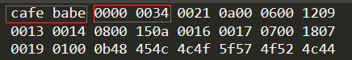

# Class文件结构

**本章所说的Class文件不一定代表物理意义上的计算机硬盘文件，也可能时从网络上加载的一段二进制流对应的数据等其他形式**

**任何一个Class文件都代表一个唯一的类或接口的定义信息，但是类和接口的定义也可以脱离Class文件存在（虚拟机动态生成的类）。**

Class文件是一组以8位字节为基础单位的二进制流，所有数据紧密的排列，没有分隔符。当遇到需要超过8位字节的空间时，按照高位在前的方式分割成若干个8位字节进行存储。

Class文件中只有两种数据结构：无符号数和表，其余所有的解析都要以这两种数据类型为基础。

- 无符号数属于基本的数据类型，用来描述数字、索引引用、数量值或按照utf-8编码构成字符串。
  - u1：代表1个字节
  - u2：代表2个字节
  - u4：代表4个字节
  - u8：代表8个字节

- 表是由多个无符号数或者其他表作为数据项构成的复合数据结构，所有的表一般都以“_info”结尾。

整个Class文件本质上就是一张表，由以下数据结构构成：

|类型|名称|数量|备注|
| :----: | :----: | :----: | :----: |
|   u4    |    magic_number     |           1           |  |
|   u2    |    minor_version    |           1           |  |
|   u2    |    major_version    |           1           |  |
|   u2    | constant_pool_count |           1           |  |
| cp_info |    constant_pool    | constant_pool_count-1 |  |
|   u2    |     access_flag     |           1           |  |
| u2 | this_flag | 1 | |
| u2 | super_class | 1 | |
| u2 | interface_count | 1 | |
| u2 | interfaces | interface_count | |
| u2 | fields_count | 1 | |
| field_info | fields | fields_count | |
| u2 | methods_count | 1 | |
| method_info | methods | methods_count | |
| u2 | attributes_count | 1 | |
| attribute_info | attributes | attributes_count | |

无论是无符号数还是表，当需要描述同一类型但数量不定的多个数据时，经常会使用一个前置计数器加若干个连续数据项的形式。

## 魔数与Class文件版本

每个Class文件的头四个字节称为魔数，唯一作用就是确定这个文件是一个能被虚拟机接受的Class文件。

紧接着的第5和第6个字节是次版本号，第7和第8字节是主版本号。高版本的JDK可以向下兼容以前版本的Class文件，但是低版本的JDK不能运行之后高版本的Class文件。

## 常量池

常量池可以理解为Class文件中的资源仓库。常量池的入口有一个u2类型的计数器。但是常量池计数不是从0开始，而是从1开始，这样做的目的是为了用0来满足某些特定情况下需要表示“不引用任何一个常量池”的意思。

常量池主要存放两大类常量：字面量（Literal）和符号引用（Symbolic References）.

- 字面量接近Java语言层面的常量概念，如字符串、使用final关键字修饰的常量值等
- 符号引用属于编译原理方面的概念，包括了下面三类常量：
  - 类和接口的全限定名（Fully Qualified Name）
  - 字段的名称和描述符（Descriptor）
  - 方法的名称和描述符

常量池的数据一共有14中类型：

|        类型        | 标志 |       说明        |
| :----------------: | :--: | :---------------: |
| CONSTANT_Utf8_info |  0X01   | utf-8编码的字符串 |
| CONSTANT_Integer_info | 0X03 | 整形字面量 |
| CONSTANT_Float_info | 0X04 | 浮点字面量 |
| CONSTANT_Long_info | 0X05 | 长整型字面量 |
| CONSTANT_Double_info | 0X06 | 双精度浮点型字面量 |
| CONSTANT_Class_info | 0X07 | 类或接口的符号引用 |
| CONSTANT_String_info | 0X08 | 字符串类型字面量 |
| CONSTANT_Fieldref_info | 0X09 | 字段的符号引用 |
| CONSTANT_Methodref_info | 0X0A | 类中方法的符号引用 |
| CONSTANT_InterfaceMethodref_info | 0X0B | 接口中方法的符号引用 |
| CONSTANT_NameAndType_info |  0X0C   | 字段或方法的部分符号引用 |
| CONSTANT_MethodHandle_info |  0X0E   | 表示方法句柄 |
| CONSTANT_MethodType_info |  0X0F   | 表示方法乐星 |
| CONSTANT_InvokeDynamic_info |  0X12   | 表示一个动态方法的调用 |
