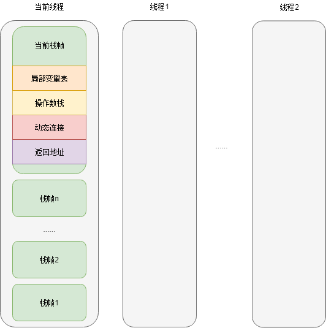
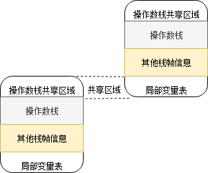

# 运行时栈帧

栈帧（Stack Frame）是用于支持虚拟机进行方法调用和方法执行的数据结构，它是虚拟机运行时数据区中的虚拟机栈的元素。储存了方法的局部变量表、操作数栈、动态连接喝方法返回地址等数据。每个方法从调用开始到返回，都对应了一个栈帧在虚拟机栈里面从入栈到出栈的过程。

在编译程序代码时，栈帧中需要多大的局部变量表、多深额操作数栈都已经完全确定，并且写到了方法表的Code属性中，因此一个栈帧需要分配多大的内存，在运行时是确定的，不会受运行时变量的影响。

一个线程中的方法调用链可能会很长，很多方法都同时处于执行状态。对于执行引擎来说，只有活动线程的虚拟机栈顶部的栈帧才是有效的，称为当前栈帧。与这个栈帧关联的方法称为当前方法。



## 局部变量表

局部变量表是一组变量存储空间，用于存储方法参数和方法内定义的局部变量。在Java文件编译为Class文件时，就在方法的Code属性的max_locals数据项中确定了该方法所需要分配的局部变量表的最大容量。

局部变量表是以变量槽（Slot）为最小单位，虚拟机规范中指定一个Slot应该能存放一个boolean、byte、char、short、int、float、reference或returnAddress类型的数据。这8种数据类型大都可以用32位或更小的内存来存放。**但是不表示Slot只能占用32位内存空间，Slot也可以使用更大的内存空间（例如64位），只要能满足存放8种类型的要求即可。**

- reference：表示一个对象实例的引用。需要通过这个引用做到以下两点：
  1. 从此引用种直接或间接地查找到对象在Java堆种地数据存放的其实地址索引
  2. 从此引用直接或间接地查找到对象所属数据类型在方法区中的类型信息

对于64位的数据，虚拟机会以高位对齐的方式为其分配两个联系的Slot空间。64位的数据只有long和double两种（64位的reference类型）。但是因为局部变量表是建立在线程私有的虚拟机栈上，对于两个Slot的64位操作，不会引起线程安全的问题。

在方法执行时，虚拟机是使用局部变量表完成参数值到参数变量列表的传递过程的。如果执行的是实例方法，那局部变量表中第0位索引的Slot默认是用于传递方法所属对象的引用（this）。其余参数按照参数表顺序排列，占用从1开始的局部变量Slot。参数表分配完毕后，再根据方法体内部定义的变量顺序和作用域分配其余的Slot。

局部变量表中的Slot是可以复用的。方法中定义的变量，在离开了作用域以后，这个变量对应的Slot就可以给其他的变量使用。

```java
public static void main(string[] args)() {
    byte[] bytes = new byte[64 * 1024 * 1024];
    int i = 1;
    System.gc();
}

public static void main(string[] args)() {
    if (true) {
    	byte[] bytes = new byte[64 * 1024 * 1024];
    }
    int i = 1; // Slot可以复用了
    System.gc();
}

public static void main(string[] args)() {
    if (true) {
    	byte[] bytes = new byte[64 * 1024 * 1024];
    }
    System.gc(); // 因为Slot的复用还没有生效，所以Slot中还有对bytes的reference。局部变量表作为GC Roots的一部分，在reference chain中还保留这对bytes的reference，所以bytes不会被回收
    int i = 1;
}
```

如果局部变量定义了但是没有赋予初始值，是无法使用的，不能通过编译。

```java
public static void main(string[] args)() {
    int i;
    System.out.println(i);
}
```

## 操作数栈

也称操作栈，是一个后入先出栈。操作数栈的最大深度也可以在编译器确定，写入到Code属性的max_stacks数据项中。操作数栈的每个元素可以是任意的Java数据类型，包括long和double。32位数据类型占的栈容量为1，64位为2.

当一个方法开始执行时，这个方法的操作数栈是空的。在执行过程中，会有各种字节码指令王操作数栈中写入和提取数据（入栈/出栈）。

在概念模型中，两个栈帧应该是相互独立的。但是可以在虚拟机的实现中做一些优化，让前一个栈帧的操作数栈和后一个栈帧的局部变量表局部重叠在一起（前一个方法的操作数正好是后一个方法的入参）。



**Java虚拟机的解释引擎被称为“基于栈的执行引擎”，“栈”就是操作数栈。**

运算只有再CPU中进行，在内存中的数据在做运算时需要经过“读取-运算-写入”的过程。

## 方法返回地址

当一个方法开始执行的时候，只有两种方式可以退出。

1. 执行引擎遇到任意一个方法返回的字节码指令，这时可能会有返回值传递给上层的方法调用者。这种退出方法称为正常完成出口（Normal Method Invocation Completion）。
2. 在方法执行过程中遇到了异常，且这个异常没有在方法体中得到处理，就会导致方法退出。称为异常完成出口（Abrupt Method Invocation Completion），这种情况是不会给上层调用者产生任何返回值。

无论是哪种退出方法，在方法退出之后，都需要返回方法被调用的位置，程序才能继续执行。方法返回时可能需要在栈帧中保存一些信息，用来帮助回复上层调用方法的执行状态。方法正常返回时，调用者的程序计数器可以作为返回地址。而异常退出时，返回地址是要通过异常处理器表来确定的，栈帧中一般不会保存这个信息。

方法退出的过程实际就是把当前栈帧出栈，因此退出时可能执行的操作有：恢复上层方法的局部变量表和操作数栈、把返回值压入上层调用方法栈帧的操作数栈、调整程序计数器的值来指向上层方法的下一条指令等。

## 动态连接

每个栈帧都包含一个指向运行时常量池中改栈帧所属方法的引用，持有这个引用是为了支持方法调用过程中的动态连接。在Class文件的常量池中存有大量的符号引用，字节码中的方法调用指令就以常量池中指向方法的符号引用作为参数。这些符号引用一部分会在类加载阶段或者第一次使用的时候就转化为直接引用，这种称为静态解析。另外一部分将在每一次运行期间转换为直接引用，这部分称为动态连接。详细内容见方法调用部分内容。

# 方法调用

方法调用不等于方法执行，调用阶段只需要确定被调用方法的版本，暂时不涉及具体的运行过程。在Class文件中不包含传统编译中的连接步骤，一切方法调用在Class文件中存储的都只是符号引用，而不是方法在实际运行时内存布局中的入口地址。

Java虚拟机提供了5条方法调用字节码指令：

1. invokestatic：调用静态方法
2. invokespecial：调用实例构造器\<init>方法、私有方法和父类方法
3. invokevirtual：调用所有的虚方法
4. invokeinterface：调用接口方法，会在运行时再确定一个实现此接口的对象
5. invoke dynamic：现在运行时动态解析出调用点限定符所引用的方法，然后再执行该方法。上面4条指令的分派逻辑时固化在Java虚拟机内部的，而这个指令的分派逻辑是由用户所设定的引导方法决定的

## 解析

所有方法调用中的目标方法在Class文件中都是一个常量池中的符号引用，在类加载的解析阶段，会将其中的一部分符号引用转化为直接引用。这种解析能成立的前提是：方法在程序真正运行之前就有一个可确定的调用版本，并且这个版本在运行期是不可改变的，即在编译时就必须确定下来。这类方法的调用称为解析（Resolution）。

在Java语言中符合“编译器可知，运行期不变”这个要求的方法，有下面两大类：

1. 静态方法：和类型直接关联
2. 私有方法：外部不可访问

它们都不能被重写成其他版本，因此可以在加载阶段进行解析。

只要能被invokestatic和invokespecial指令调用的方法，即静态方法、私有方法、实例构造函数、父类方法四类，在类加载的解析阶段，会把符号引用解析为该方法的直接引用。这些方法可以被称为非虚方法，对应的，其他类型的方法被称为虚方法（final方法不算）。

~~~java
public class Resolution extends Demo {
    
    public Resolution() {
        super();
    }
    
    public static void hello() {
        System.out.println("hello");
    }
    
    private void hello1() {
        System.out.println("hello");
    }
    
    public void hello2() {
        super.hello2("hello");
    }
}
~~~

除了使用invokestatic和invokespecial调用之外，使用final关键字修饰的方法也是非虚方法。虽然这种方法是用invokevirtual指令来调用，但是因为它无法被覆盖，没有其他版本，无法进行多态选择，所以也是一种非虚方法。

解析调用是一个静态的过程，在编译期间就完全确定，在类加载的解析阶段就会把涉及的符号引用全部转变为确定的直接引用，不会延迟到运行期再去确定。

### 静态重载解析（Method Overload Resolution）

```java
public class StaticResolution {
    
    static abstract class Human {
        
    }
    
    static class Man extends Human {
        
    }
    
    static class Woman extends Human {
        
    }
    
    public void hello(Human human) {
        System.out.println("hello, human");
    }
    
    public void hello(Man man) {
        System.out.println("hello, man");
    }
    
    public void hello(Woman woman) {
        System.out.println("hello, woman");
    }
    
    public static void main(String[] args) {
        Human man = new Man();
        Human woman = new Woman();
        StaticResolution sr = new StaticResolution();
        sr.hello(man);
        sr.hello(woman);
    }
}

结果：
hello, human
hello, human
```

声明部分定义的是变量的静态类型（Static Type），构造器反映的是变量的实际类型（Actual Type）。两者都可能在程序中发生变化，静态类型的变化只在使用时发生，且变量本身的静态类型不会被改变，最终的静态类型在编译阶段可以确定。

- 静态类型变化

```java
 sr.hello((Man)man);
```

实际类型的变化往往在运行时才能确定逻辑，编译器在编译程序的阶段并不知道一个对象变量的实际类型是什么。

- 实际类型变化

```java
if (xxx) {
    man = new Man();
} else {
    man = new Woman();
}
```

编译器在处理此种重载时，使用重载方法的哪个版本完全取决于入参的数量和数据类型。编译器会依据参数的静态类型而不是实际类型作为判断的依据。同时由于静态类型时编译器可知的，所以编译器可以在编译器确定使用方法重载的哪个版本，并将对应方法的符号引用写道invokevirtual指令的参数中。

依赖静态类型来定位方法执行版本的动作被称为静态重载解析。静态重载解析发生在编译阶段，因此确定方法版本的动作不是由虚拟机执行，而是由编译器确定。

需要注意的是，编译器虽然能够确定出方法的重载版本，但在很多情况下这个重载版本并不是“唯一”的，而是一个“更加合适”的版本。产生这种情况的原因是字面量不需要定义，也就没有声明静态类型，所以它的静态类型只能“推断”而不是“确定”。

~~~java
public class Overload {
    
    public static void hello(Object arg) {
        System.out.println("hello obj");
    }
    
    public static void hello(int arg) {
        System.out.println("hello int");
    }
    
    public static void hello(long arg) {
        System.out.println("hello long");
    }
    
    public static void hello(char arg) {
        System.out.println("hello char");
    }
    
    public static void hello(char... arg) {
        System.out.println("hello char...");
    }
    
    public static void hello(Charater arg) {
        System.out.println("hello Charater");
    }
    
    public static void hello(Charater arg) {
        System.out.println("hello Charater");
    }
    
    public static void main(String[] args) {
        hello('a'); // 这个'a'是个int？还是char？还是long？或其他？
    }
}
~~~


## 动态分派（Dynamic Dispatch）

动态分派和多态性的另外一个重要体现：重写（Override）密切相关。

~~~java
public class DynamicDispatch {
    
    static abstract class Human {
        protected abstract void hello();
    }
    
    static class Man extends Human {
        @Overrride
        protected void hello() {
            System.out.println("hello man");
        }
    }
    
    static class Woman extends Human {
        @Overrride
        protected void hello() {
            System.out.println("hello woman");
        }
    }
    
    public static void main(String[] args) {
        Human man = new Man();
        Human woman = new Woman();
        man.hello();
        woman.hello();
        man = new Woman();
        man.hello();
    }
}

运行结果：
hello man
hello woman
hello woman
~~~

在执行方法调用时，如果不是在编译器已经确定的invokestatic和invokespecial指令，则先会把被调用方法对象的引用压入操作数栈，然后invokevirtual会进行运行时解析，大致分为以下几个步骤：

1. 找到操作数栈顶元素指向的对象的实际类型，记错C。
2. 如果在C中找到与常量中的描述符和简单名称都相符的方法，则进行访问权限校验，如果通过校验则返回这个方法的直接引用，查找结束；否则返回java.lang.IllegalAccessError异常。
3. 如果2的查找没有结束，继续按照继承关系从下往上依次对C的各个父类进行第2步的过程。
4. 如果还是找不到，抛出java.lang.AbstractMethodError异常。

invokevirtual指令执行的第一步就是在运行期确定方法接受者的实际类型，然后可以把invokevirtual指导使用的常量池中的类方法符号引用解析到了不同的直接应用上。这种在运行期根据实际类型确定方法执行版本的分派过程称为动态分派。

