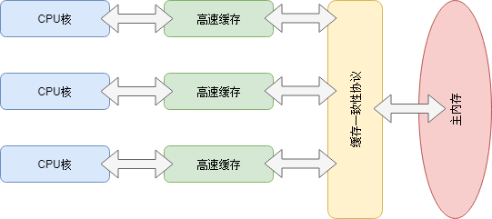
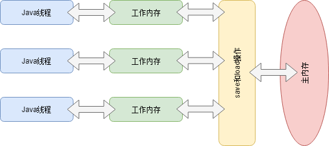

# 内存模型的意义：效率与一致性

在计算机进行运算时，CPU需要借助内存来存放数据，经过“读取-计算-写入”的流程与内存交互。但是内存的读取/写入速度比CPU的运算速度慢很多，所以引入了高速缓存（寄存器）来作为两者之间的缓冲。

为了解决多个CPU核和高速缓存向主内存同步的问题，定义实现了许多一致性协议。

为了使CPU内部的运算单元能够尽量充分被利用，CPU可能会对输入代码进行乱序执行（Out-Of-Order Execution）优化，Java虚拟机的即时编译器中也有类似的指令重排序优化。

为了屏蔽上述各种细节再各种硬件和操作系统之间的差异，Java虚拟机尝试定义了Java内存模型（Java Memory Model）来达到一致的内存访问效果。

# Java内存模型

直接使用物理硬件和操作系统内存模型的各种程序语言（C/C++），会因为不同平台上内存模型的差异，导致程序在一套平台上开发完毕以后，在另外一种平台上访问却经常出错。

## 主内存与工作内存

Java内存模型规定了所有的变量都存储在主内存中 ，每条线程还有自己的工作内存。线程的工作内存保存了该线程使用到的变量的主内存副本拷贝，线程对变量的所有操作（读、写）都必须在工作内存中执行，而不能直接操作主内存中的变量。不同线程之间也无法直接访问对方工作内存中的变量，线程间的变量值传递都需要通过主内存来完成。

- 局部变量与方法参数不会收此约束，因为它们都是线程私有，不存在竞争
- 如果局部变量是一个引用（reference）类型，它自身是线程私有的，但是它引用的对象还是在主内存中
- 对于对象，工作内存中存放的是它的引用（reference）类型，而不是整个对象
- volatile变量依然有工作内存的拷贝，但是由于它特殊的操作顺序规定，操作效果等效于直接在主内存中操作
- 主内存/工作内存的分类方式和Java虚拟机内存区域的堆、栈、方法区等不是同一个层次的划分，是从不同的维度来看待问题

## 内存间交互操作

Java内存模型中定义了以下8种操作来完成变量在主内存和工作内存之间的操作。每种操作都是原子的、不可再分的（对于long和double这种64位数据类型，load、store、read和write允许有例外）。

- lock（锁定）：作用于主内存的变量，把一个变量标识为一条线程独占的状态
- unlock（解锁）：作用于主内存的变量，把一个处于锁定状态的变量释放出来，使其可以被其他线程锁定
- read（读取）：作用于主内存的变量，把一个变量的值从主内存传输到线程的工作内存种，供后续的load操作使用
- load（载入）：作用于工作内存的变量，把read操作从主内存读取的变量值放入工作内存的变量副本中
- use（使用）：作用于工作内存的变量，把工作内存中的一个变量的值传递给执行引擎，当虚拟机遇到一个需要使用到变量的值的字节码指令时会执行这个操作
- assign（赋值）：作用于工作内存的变量，把一个从执行引擎接受到的值赋给工作内存的变量，当虚拟机遇到一个给变量赋值的字节码指令时执行这个操作
- store（存储）：作用于工作内存的变量，把工作内存中一个变量的值传送到主内存中，以便后续的write操作使用
- write（写入）：作用于主内存的变量，把store操作从工作内存得到的变量值写入主内存的变量中

Java内存模型规定了上述操作的顺序，但是没有保证一定时连续执行。例如要把一个变量从主内存复制到工作内存，需要顺序的执行read和load操作，但是在read和load之间有可能会插入其他的动作，即read a、read b、load b、load a这种情况。

Java内存模型还规定了执行上述8种基本操作时的规则：

- 不允许read和load单独出现，即不允许一个变量从主内存读取了却没有写入工作内存
- 不允许store和write单独出现，即不允许一个变量从工作内存读取了却没有写入主内存
- 不允许一个线程丢弃它最近的assign操作，即变量在工作内存中改变了必须同步回主内存
- 不允许一个线程无原因地把数据从工作内存同步回住内存，即工作内存的变量只有改变了才能同步回主内存
- 新的变量只能在主内存中创建，不允许在工作内存中直接使用一个未被初始化（load或assign）的变量，即工作内存中的变量在user和store之前，必须经过load和assign操作
- 一个变量在同一时刻只允许被一个线程lock，但一个线程可以对一个变量lock多次，多次lock以后，必须执行同样次数的unlock操作，变量才会被解锁
- 如果一个变量没有被lock操作锁定，那就不允许对它执行unlock操作，也不允许线程去unlock被其他线程lock的变量
- 对一个变量unlock之前，必须把它同步回主内存

## volatile型变量

volatile型变量会具有两种特性：

1. 保证此变量对所有线程的“可见性”，指当一条线程修改了这个变量的值，新值对于其他线程是立即可见的。普通变量无法做到这一点，因为普通变量的值需要通过主内存进行同步。另一条线程只有同步完成后的进行从主内存的读取操作时，新变量值才会对其可见。但是由于线程内的运算可能不是原子性的，在线程获得了volatile便量的最新值后，依然有可能因为非原子性导致变量值“过期”，计算结果“失效”。
2. 禁止针对此变量的指令重排序优化。普通的变量仅仅会保证在该方法的执行过程中所有依赖赋值结果的地方都能获取到正确的结果，而不能保证变量赋值操作的顺序于程序代码中的执行顺序一致。

Java内存模型对volatile变量的特殊规则。假设T标识一个线程，V和W分布表示两个volatile型变量，那么在进行read、load、use、assign、store和write操作时需要满足如下规则：

- 只有当线程T对变量V执行的前一个动作时load的时候，线程T才能对变量V执行use动作；并且，只有当线程T对V执行的后一个动作时use的时候，线程T才能对变量V执行load动作。线程T对变量V的use动作可以认为是和load、read动作相关联，必须一起出现。这条规则要求在工作内存中，每次使用V前都必须先从主内存刷新最新的值，用于保证能看见其他线程对变量V所作的修改。
- 只有当线程T对变量V执行的前一个动作时assign的时候，线程T才能对变量V执行store动作；并且，只有当线程T对V执行的后一个动作时store的时候，线程T才能对变量V执行assign动作。线程T对变量V的assign动作可以认为是和store、write动作相关联，必须一起出现。这条规则要求在工作内存中，每次修改V后都必须立即刷新回主内存，用于保证其他线程能看见此次对变量V所作的修改。
- 假定动作A是线程T对变量V实施的use或assign动作，假设动作F是和动作A相关联的load或store动作，假设动作P是和动作F相应的对变量V的read或write操作；类似的，假定动作B是线程T对变量W实施的use或assign动作，假设动作G是和动作A相关联的load或store动作，假设动作Q是和动作F相应的对变量V的read或write操作。如果A先于B，那么P先于Q。这条规则保证了volatile型变量不会被指令重排优化，保证代码执行顺序和程序编写顺序相同。

## long和double型变量的特殊规则

允许虚拟机将没有被volatile修饰的64位数据的读写操作划分成两次32位的操作来进行，即允许虚拟机可以不保证64位数据类型的load、store、read和write这4个操作的原子性。

## 原子性、可见性与有序性

### 原子性（Atomicity）

由Java内存模型来直接保证的原子性变量操作包括：read、load、assign、use、store和write。除了long和double其他的基本数据类型访问读写都是原子性的。

在更大级别的原子性保证情况中，Java内存模型还提供了lock和unlock操作来满足需求。这两个操作对应的字节码指令是monitorenter和monitorexit，即synchronized关键字，所以在synchronized关键字之间的操作也具备原子性。

### 可见性（Visibility）

指一个线程修改了共享变量的值，其他线程能够立即得到这个修改。Java内存模型是通过将修改后的值同步回主内存，在变量读取前从主内存刷新到工作内存这种依赖主内存作为中介的方式来实现可见性。

volatile型变量保证了修改后的值能够立即同步回主内存，且在使用前立即从主内存刷新到工作内存。普通变量没有此种机制。因此volatile型变量保证了多线程操作时变量的可见性，而普通变量无法做到。

还有两个关键字能够实现可见性：synchronized和final。同步块的可见性是由“对一个变量执行unlock之前，必须先把此变量同步回主内存中”这条规则来获得的。而final关键字的可见性是指被final修饰的字段在初始化完成后就不能修改，所以一定能被看见。

~~~java
// this逃逸
public class Test {
    public final static int = 1;
    
    private Test1 test1;
    
    public Test(Test1 test1) {
        super();
        this.test1 = test1;
        test1.setTest(this);
    }
}

public class Test1 {
    private Test test;
    
    public void setTest(Test test) {
        this.test = test;
    }
}
~~~

### 有序性（Ordering）

Java天然的有序性是指：如果在本线程中观察，所有操作都是有序的（线程内表现为串行的语义）；如果观察另外一个线程，所有操作都是无序的（指令重排序和工作内存与主内存的同步延迟）。

Java语言提供了volatile和synchronized两个关键字来保证线程之间操作的有序性。volatile关键字禁止了指令重排序且保证了工作内存和主内存的同步没有延迟。synchronized则通过“一个变量在同一个时间只允许一条线程对其lock”来保证持有同一个锁的两个同步块只能串行地进入。

## 先行发生原则

下面是Java内存模型下的一些“天然”的先行发生关系，可以在编码时直接使用。如果两个操作之间的关系不在此列，且无法从下列规则推导出来，它们就没有顺序的保证，虚拟机可以对它们随意进行重排序。

- 程序次序原则（Program Order Rule）：在一个线程内，按照代码流程顺序执行。
- 管程锁定规则（Monitor Lock Rule）：一个unlock操作先行发生于后面对**同一个锁**的lock操作。
- volatile变量规则（Volatile Variable Rule）：对一个volatile变量的写操作先行发生于后面对这个变量的读操作。
- 线程启动规则（Thread Start Rule）：Thread对象的start（）方法先行发生于此线程的每一个动作。
- 线程终止规则（Thread Termination Rule）：线程中的所有操作都先行发生于对此线程的终止检测（Thread.join()方法返回、Thread.isAlive()的返回值）。
- 线程中断规则（Thread Interruption Rule）：对线程interrupt()方法的调用先行发生于被中断线程的代码检测到中断事件的发生，可以通过Thread.interrupted()方法检测到是否有中断发生。
- 对象终结原则（Finalized Rule）：一个对象的初始化完成（构造函数执行结束）先行于他的finalize（）方法。
- 传递性（Transitivity）：如果操作A先行于B，操作B先行于C，那么操作A先行于C。