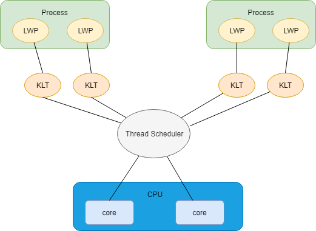
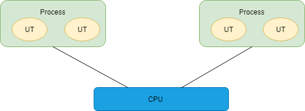
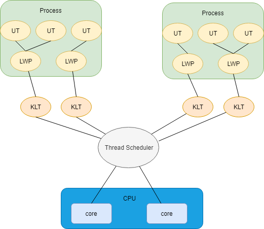
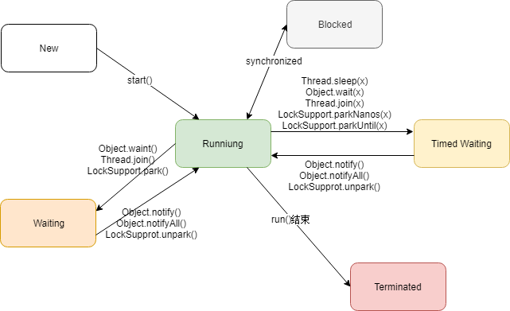

# 线程的实现方式

## 使用内核线程实现

内核线程（Kernel-Level Thread，KLT）是直接由操作系统内核（Kernel）支持的线程，由内核来完成线程切换，内核通过操纵调度器（Scheduler）对线程进行调度，并将线程映射到各个处理器上，

程序一般不会直接使用内核线程，而是使用内核线程的一种高级接口：轻量级进程（Light Weight Process，LWP），这就是我们通常意义上讲的线程。

由于内核线程的支持，每个轻量级线程都成为一个独立的调度单元。但是轻量级线程具有它的局限性：

1. 基于内核线程实现，各种线程操作，例如创建、销毁、同步都需要进行系统调用。而系统调用需要在用户态和内核态中来回切换，调用代价较高。
2. 每个轻量级线程都需要一个内核线程支持，需要消耗一定的内核资源，因此一个系统支持的轻量级进程的数量是有限的。

## 使用用户线程实现

狭义的用户线程（广义用户线程包括LWT ）是指完全建立在用户空间的线程库上，系统内核不能感知的线程。用户线程的创建、同步、销毁和调度都在用户态完成，不需要内核的帮助。这种线程的实现可以是非常快速却低消耗的，也可以支持更大规模的线程数量。

使用用户线程的优势在于不需要系统内核的支持，所以性能更好。同时由于缺少了系统内核的支持，所有线程的实现都需要用户程序自己处理，导致实现比较复杂。

## 使用用户线程加轻量级进程混合实现

线程除了依赖内核线程实现和完全由用户程序自己实现之外，还有一种混合一起使用的实现方式。用户线程还是完全建立在用户空间中，因此用户线程的创建、切换、析构等操作依然廉价，并且可以支持大规模的用户线程并发。而操作系统提供的轻量级进程作为用户线程和内核线程之间的桥梁，来使用内核提供的线程调度功能及处理器映射。

## Java的线程实现

对于Sun JDK来说，它的Windows版本和Linux版本都是使用一对一的线程模型实现的，一条Java线程映射到一条轻量级进程。

而在Solaris平台中，由于操作系统的线程特性可以支持一对一及多对多的线程模型，英雌Solaris平台的虚拟机可以通过参数来指定线程模型。

# Java线程调度

## 协同式线程调度（Cooperative Thread-Scheduling）

线程的执行时间由线程本身来控制，线程完成了自己的工作之后，要主动通知系统切换到另外一个线程。

好处：

- 实现简单
- 没有线程同步问题

坏处：

- 如果一个线程编写有问题，没有发送通知，程序会一直阻塞

## 抢占式线程调度（Preemptive Thread-Scheduling）

线程由操作系统来分配执行时间，线程的切换不由线程本身来决定。

好处：

- 线程的执行时间可控，不会因为线程导致进程的阻塞

坏处：

- 实现比较复杂
- 产生了线程同步的问题

**Java使用的是抢占式调度。**

# Java线程的状态转换

Java语言定义了5种线程状态。在任意时间点，一个线程有且只能有其中一个状态：

- 新建（New）：创建后尚未启动的线程处于这种状态
- 运行（Running）：包括了操作系统线程状态中的Running和Ready，也就是说处于此状态的线程有可能正在执行，也有可能在等到CPU分配执行时间
- 无限期等待（Waiting）：处于这种状态下的线程不会被分配CPU执行时间，要等待被其他线程显式地唤醒，以下方法会导致线程陷入无限期等待状态：
  - 没有设置Timeout参数的Object.wait()方法
  - 没有设置Timeout参数的Thread.join()方法
  - LockSupport.park()方法
- 限期等待（Timed Waiting）：处于这种状态地线程也不会被分配CPU时间，不过除了被其他线程显式地唤醒之外，在一定时间后它们会由系统自动唤醒。以下方法会导致线程陷入限期等待状态：
  - Thread.sleep()
  - 设置了Timeout参数的Object.wait()方法
  - 设置了Timeout参数的Thread.join()方法
  - LockSupport.parkNanos()方法
  - LockSupport.parkUntil()方法
- 阻塞（Blocked）：线程“阻塞”和线程“等待”的区别是：
  - “阻塞”是在等待获取到一个排他锁，这个事件将在另外一个线程放弃这个锁的时候发生
  - “等待”是等待一段时间，或者唤醒动作的发生
- 结束（Terminated）：线程的终止状态。

