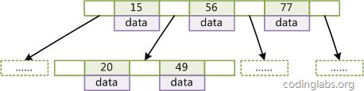
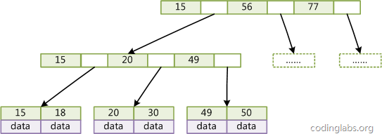

# 索引概述

## B-Tree索引（多路平衡树）

特点：

+ 每个非叶子节点会带有多个子节点
+ 每个叶子节点到根节点的距离相同
+ 非叶子节点包含索引值和数据值组成的block和指向子节点的指针
+ 非叶子节点的索引值顺序排列
+ 非叶子节点的两个block之间存放指向子节点的指针，子节点包含的索引值在两个block的索引值之间

## B+Tree（多路平衡查找树）

特点：

+ 每个非叶子节点会带有多个子节点
+ 每个叶子节点到根节点的距离相同
+ 非叶子节点包含索引值和指向子节点的指针
+ 非叶子节点的索引值顺序排列
+ 非叶子节点的两个索引之间存放指向子节点的指针，子节点包含的索引值在两个索引值之间

MySQL中InnoDB和MyISAM都是使用B+Tree来实现BTREE索引。

## 哈希索引

基于哈希表实现。

## 空间数据索引

基于R-Tree实现。主要用来存储地理数据。

## 全文索引

对文本中的关键字进行索引，不是直接比较文本的值。

# 使用索引的优点

+ 可以大大减少服务器需要扫描的数据的数量
+ 可以帮助服务器避免排序和临时表
+ 可以将随机IO转变为顺序IO

# 索引的评级

+ 一星级索引：索引将相关的记录放到了一起
+ 二星级索引：索引的数据顺序和查找的顺序一致
+ 三星级索引：索引包含了查询中需要的所有列

# 索引的选择性

+ 索引列的不重复值数量/行的总数
+ 值一定大于0小于1
+ 越大越好