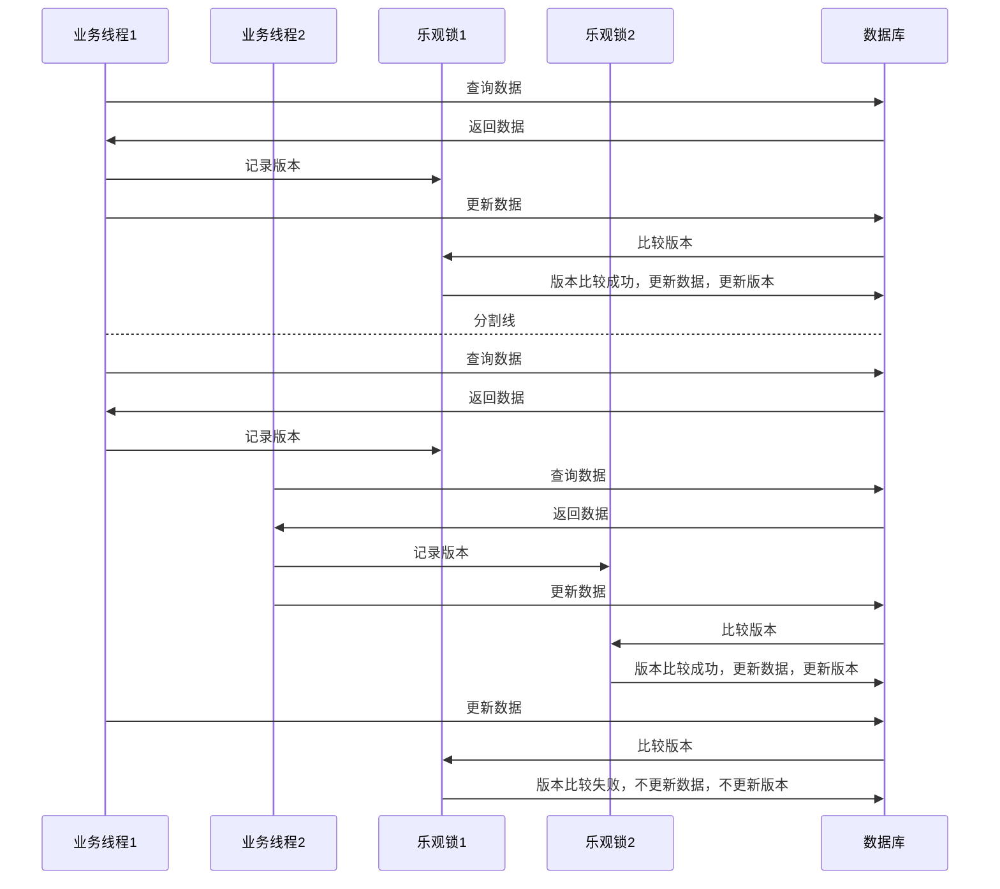

本节实例数据库请见[文件](./2.1/create_table.sql)，讨论基于InnoDB引擎

# 乐观锁与悲观锁

## 乐观锁

特点：

+ 获取数据时不对数据加锁，不阻塞其他线程
+ 数据查询可以并发执行，数据更新也可以并发执行
+ 数据在更新时进行CAS（compare and set）
+ 可以额外增加版本号的列实现乐观锁，更新时比较版本号保证数据没有“脏”

~~~
-- 第一个事务中获取基准数据
select * from t_2_1 where id = 5;

-- 第二个事务中更新数据，查看结果数据已经更新
update t_2_1 set age = 20, data_version = data_version + 1 where id = 5 and data_version = 1;
select * from t_2_1 where id = 5;

-- 第一个事务中更新数据，查看结果，由于data_version列已经更新，此次更新失败
update t_2_1 set age = 15, data_version = data_version + 1 where id = 5 and data_version = 1;
select * from t_2_1 where id = 5;
~~~



## 悲观锁

特点：

+ 获取数据时对数据加锁，有可能阻塞其他线程
+ 数据查询有可能并发执行，数据更新不可以并发执行
+ 数据更新操作串行执行
+ 悲观锁模式有共享锁（读锁，shared lock）和排他锁（写锁，exclusive lock）
+ 悲观锁的实现方式有表锁和行锁

~~~
-- 第一个事务中获取基准数据并加锁
set autocommit = 0;
begin;
select * from t_2_1 where id = 5 for update;

-- 第二个事务中更新数据，操作被阻塞，等到第一个事务提交，查看结果数据已经更新
set autocommit = 0;
begin;
update t_2_1 set age = 20, data_version = data_version + 1 where id = 5;
commit;
select * from t_2_1 where id = 5;

-- 第一个事务中更新数据，此次更新成功，在提交之前会阻塞第二个事务
update t_2_1 set age = 15, data_version = data_version + 1 where id = 5;
commit;
select * from t_2_1 where id = 5;
~~~

# 读锁与写锁

## 读锁

特点：

- 获取数据时对数据加锁，不阻塞读锁线程，阻塞写锁线程
- 数据查询可以并发执行，数据更新串行执行

```
-- 第一个事务中获取数据，加读锁
set autocommit = 0;
begin;
select * from t_2_1 where id = 5 LOCK IN SHARE MODE;

-- 第二个事务中查询数据，加读锁，可以查询到
set autocommit = 0;
begin;
select * from t_2_1 where id = 5 LOCK IN SHARE MODE;
commit;

-- 第一个事务提交
commit;
```

```
-- 第一个事务中获取数据，加读锁
set autocommit = 0;
begin;
select * from t_2_1 where id = 5 LOCK IN SHARE MODE;

-- 第二个事务中查询数据，加写锁，被阻塞
set autocommit = 0;
begin;
select * from t_2_1 where id = 5 for update;
commit;

-- 第一个事务提交，释放读锁，第二个事务继续
commit;
```

## 写锁

特点：

- 获取数据时对数据加锁，一定阻塞其他线程
- 数据查询串行执行，数据更新串行执行

```
-- 第一个事务中获取数据，加写锁
set autocommit = 0;
begin;
select * from t_2_1 where id = 5 for update;

-- 第二个事务中查询数据，加读锁，被阻塞
set autocommit = 0;
begin;
select * from t_2_1 where id = 5 LOCK IN SHARE MODE;
commit;

-- 第一个事务更新数据并提交，释放写锁，第二个事务继续，读到新数据
update t_2_1 set age = 19 where id = 5;
commit;
```

# 行锁与表锁

## 行锁

特点：

+ 只锁定特定的一行或者几行，不会对整张表加锁
+ 基于主键加锁，因此只有使用索引查询到主键时可以使用行锁
+ 不适用索引的查询无法使用行锁，只能使用表锁
+ 并发支持好，开销大

~~~
-- 第一个事务中获取数据，基于主键加写锁
set autocommit = 0;
begin;
select * from t_2_1 where id = 5 for update;

-- 第二个事务中查询数据，主键相等的被阻塞
set autocommit = 0;
begin;
select * from t_2_1 where id = 5 LOCK IN SHARE MODE;
commit;

-- 第三个事务中查询数据，加读锁，主键不相等的可以被查询出来
set autocommit = 0;
begin;
select * from t_2_1 where id = 4 LOCK IN SHARE MODE;
commit;

-- 第一个事务更新数据并提交，释放写锁，第二个事务继续，读到新数据
update t_2_1 set age = 19 where id = 5;
commit;
~~~

~~~
-- 第一个事务中获取数据，基于二级索引主键加写锁
set autocommit = 0;
begin;
select id from t_2_1 where age = 12 for update;

-- 第二个事务中查询数据，主键被二级索引应用的被阻塞
set autocommit = 0;
begin;
select * from t_2_1 where id = 1 LOCK IN SHARE MODE;
commit;

-- 第三个事务中查询数据，主键被二级索引应用的被阻塞
set autocommit = 0;
begin;
select * from t_2_1 where id = 3 LOCK IN SHARE MODE;
commit;

-- 第一个事务更新数据并提交，释放写锁，第二、三个事务继续，读到新数据
update t_2_1 set data_version = data_version + 1 where age = 12;
commit;
~~~


## 表锁

特点：

- 对张表加锁
- 基于主键加锁，因此只有使用索引查询到主键时可以使用行锁
- 并发支持不好，开销小

~~~
-- 第一个事务中获取数据，不使用索引加写锁
set autocommit = 0;
begin;
select id from t_2_1 where last_name = 'Lee' for update;

-- 第二个事务中查询数据，被阻塞
set autocommit = 0;
begin;
select * from t_2_1 where id = 1 LOCK IN SHARE MODE;
commit;

-- 第一个事务更新数据并提交，释放写锁，第二个事务继续，读到数据
commit;
~~~

# 死锁

## 发生死锁的条件

循环等待互斥条件

~~~
-- 第一个事务中获取数据，使用主键加写锁
set autocommit = 0;
begin;
select id from t_2_1 where id = 1 for update;

-- 第二个事务中获取数据，使用主键加写锁
set autocommit = 0;
begin;
select id from t_2_1 where id = 2 for update;

-- 第一个事务等待第二个事务加锁的主键
select id from t_2_1 where id = 2 for update;

-- 第一个事务等待第二个事务加锁的主键
select id from t_2_1 where id = 1 for update;
~~~


## 解决死锁的方法

**第一种**：

1. 查询是否锁表

```
show OPEN TABLES where In_use > 0;
```

2. 查询进程（如果您有SUPER权限，您可以看到所有线程。否则，您只能看到您自己的线程）

```
show processlist
```

3. 杀死进程id（就是上面命令的id列）

```
kill id
```

**第二种**：

1. 查看当前的事务

```
SELECT * FROM INFORMATION_SCHEMA.INNODB_TRX;
```

2. 查看当前锁定的事务

```
SELECT * FROM INFORMATION_SCHEMA.INNODB_LOCKS;
```

3. 查看当前等锁的事务

```
SELECT * FROM INFORMATION_SCHEMA.INNODB_LOCK_WAITS;
```

4. 杀死进程

```
kill 进程ID
```

## 避免死锁的方法

+ 按同一顺序访问对象。
+ 避免事务中的用户交互。
+ 保持事务简短并在一个批处理中。
+ 使用低隔离级别。
+ 使用绑定连接。