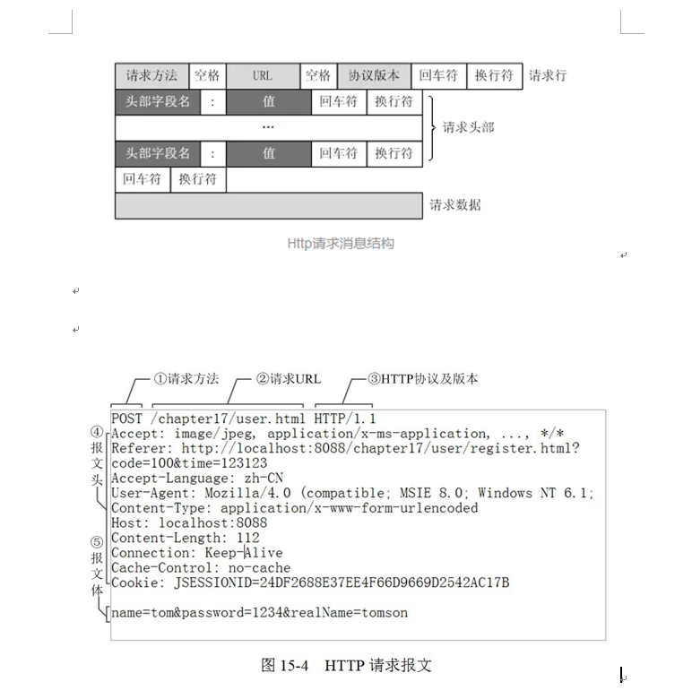
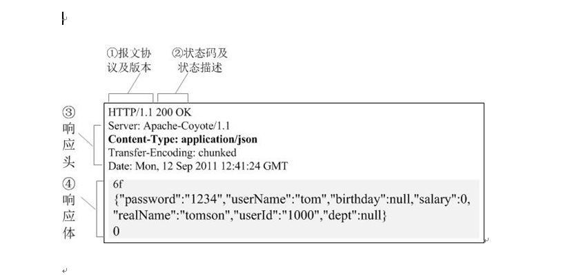
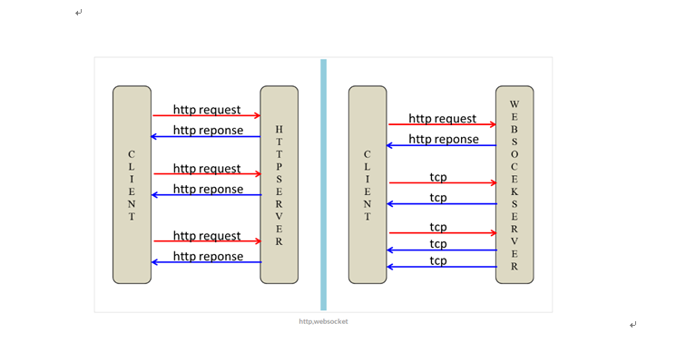
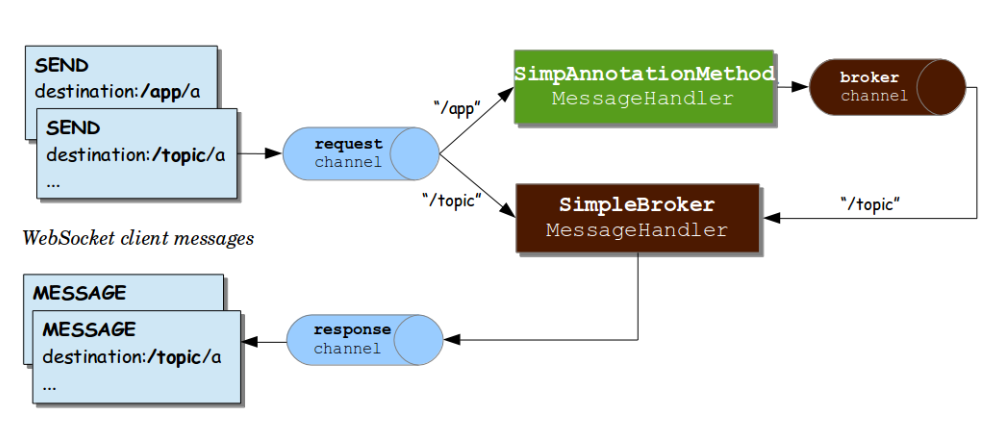

# WebSocket初探

**先考个古**
一直以来，前端都缺少一种实时的跟后端交互的机制。这其实是http协议的限制。http协议是典型的“请求-响应”式的协议，换句话说后端不能主动向前端“推送”数据，而必须等待前端先发起请求。

以前的方式  
ajax轮询  
让浏览器隔个几秒就发送一次请求，询问服务器是否有新信息。  
场景再现：
客户端：啦啦啦，有没有新信息(Request)  
服务端：没有（Response）  
客户端：啦啦啦，有没有新信息(Request)  
服务端：没有。。（Response）  
客户端：啦啦啦，有没有新信息(Request)  
服务端：你好烦啊，没有啊。。（Response）  
客户端：啦啦啦，有没有新消息（Request）  
服务端：好啦好啦，有啦给你。（Response）
客户端：啦啦啦，有没有新消息（Request）  
服务端：。。。。。没。。。。没。。。没有（Response） ---- loop  

long poll
也是采用轮询的方式，不过采取的是阻塞模型，客户端发起连接后，如果没消息，就一直不返回Response给客户端。直到有消息才返回，返回完之后，客户端再次建立连接，周而复始。  
场景再现：  
客户端：啦啦啦，有没有新信息，没有的话就等有了才返回给我吧（Request）  
服务端：额。。 等待到有消息的时候。。来 给你（Response）  
客户端：啦啦啦，有没有新信息，没有的话就等有了才返回给我吧（Request） -loop  

从上面可以看出其实这两种方式，都是在不断地建立HTTP连接，然后等待服务端处理，可以体现HTTP协议的另外一个特点，被动性，其实就是，服务端不能主动联系客户端，只能有客户端发起。  

ajax轮询 需要服务器有很快的处理速度和资源。（速度）  
long poll 需要有很高的并发，也就是说同时接待客户的能力。（场地大小）  
所以ajax轮询 和long poll 都有可能发生这种情况。  
客户端：啦啦啦啦，有新信息么？  
服务端：正忙，请稍后再试（503 Server Unavailable）  
客户端：。。。。好吧，啦啦啦，有新信息么？  
服务端：月线正忙，请稍后再试（503 Server Unavailable）  

**什么是WebSocket**
HTML5开始提供的一种浏览器与服务器进行全双工通讯的网络技术，属于应用层协议。它基于TCP传输协议，并复用HTTP的握手通道，它实现了浏览器与服务器全双工(full-duplex)通信——允许服务器主动发送信息给客户端。 
在webscoket协议中, client利用http来建立tcp连接, 建立tcp连接之后, client与server就可以基于tcp连接来愉快的进行通信了.

复习下http

**WebSocket的握手过程**
WebSocket虽然是独立于HTTP的另一种协议，但建立连接时却需要借助HTTP协议进行握手，这也是WebSocket的一个特色，利用了HTTP协议中一个特殊的header：Upgrade。在双方握手成功后，就跟HTTP没什么关系了，会直接在底层的TCP Socket基础上进行通信。

1GET ws://localhost:8080/handlerA HTTP/1.1  
2Host: localhost:8080  
3Connection: Upgrade  
4Pragma: no-cache  
5Cache-Control: no-cache  
6Upgrade: websocket  
7Origin: http://localhost:8080  
8Sec-WebSocket-Version: 13  
9Sec-WebSocket-Key: IbMym0RGM6WulBh40amXHw==  
10Sec-WebSocket-Extensions: permessage-deflate; client_max_window_bits  

Connection: Upgrade：表示要升级协议  
Upgrade: websocket：表示要升级到websocket协议。  
Sec-WebSocket-Version: 13：表示websocket的版本。如果服务端不支持该版本，需要返回一个Sec-WebSocket-Versionheader，里面包含服务端支持的版本号。  
Sec-WebSocket-Key：与后面服务端响应首部的Sec-WebSocket-Accept是配套的，提供基本的防护，比如恶意的连接，或者无意的连接。是一个base64编码的字符串  
如果握手成功，返回HTTP 101响应：  
1HTTP/1.1 101 Switching Protocols  
2Server: Apache-Coyote/1.1  
3Upgrade: websocket  
4Connection: upgrade  
5Sec-WebSocket-Accept: FcSPcCOgjs4tIy0aH9in+QmWXcg=  
6Sec-WebSocket-Extensions: permessage-deflate;client_max_window_bits=15  
7Date: Tue, 21 Mar 2019 06:17:04 GMT  
注意其中的Sec-WebSocket-Accept字段，就是服务端根据Sec-WebSocket-Key计算后的值。客户端必须校验这个值，校验通过才能建立连接。  

场景再现  
服务端：ok，确认，已升级为Websocket协议  
客户端：麻烦你有信息的时候推送给我噢。。  
服务端：ok，有的时候会告诉你的。  
服务端：balabalabalabala服务端：balabalabalabala  
服务端：哈哈哈哈哈啊哈哈哈哈  
  
相比HTTP（ keep-alive ， comet）长连接，WebSocket有以下特点：是真正的全双工方式，建立连接后客户端与服务器端是完全平等的，可以互相主动请求。而HTTP长连接基于HTTP，是传统的客户端对服务器发起请求的模式。HTTP长连接中，每次数据交换除了真正的数据部分外，服务器和客户端还要大量交换HTTP header，信息交换效率很低。Websocket协议通过第一个request建立了TCP连接之后，之后交换的数据都不需要发送 HTTP header就能交换数据，这显然和原有的HTTP协议有区别所以它需要对服务器和客户端都进行升级才能实现  
提个问题：  
scoket ，webscoket区别？  

**发送数据**  
websocket连接已经建立, 由于websocket没有规范payload的格式, 所以应用需要自己去定义payload的格式.  

websocket的payload可以是文本也可以是二进制. 
应用一般会选择用文本. 
这个文本是什么格式websocket协议本身并没有规定, 由应用自己来定.

比如我要请求发送消息这个接口, 那么我的payload可以写成:  

/send | params=我是消息  
1
这里我自己定义了一个格式, 中坚线之前的是要调用的地址, 中竖线之后是参数.   
由于格式是自己定义的, 所以在服务端我也需要自己写代码来解析这个格式.   
把/send路由到相应的处理方法.  

那有没有一种统一的协议呢? 统一的标准呢?   
因为这样就会有相应的已经实现的库来解析路由, 而不用自己去写, 自己去定义格式.  

**stomp协议**
stomp是一个用于client之间进行异步消息传输的简单文本协议, 全称是Simple Text Oriented Messaging Protocol.  
STOMP其实跟WebSocket没啥必然关系，它是一种mq协议，最初是设计出来给各种脚本语言用的，跟它对等的应该是AMQP、MQTT等协议。  
但STOMP协议更简洁，只有publish-subscribe模式  
 就像HTTP在TCP套接字之上添加了请求-响应模型层一样，STOMP在WebSocket之上提供了一个基于帧的线路格式（frame-based wire format）层，用来定义消息的语义。  

stomp协议中的client分为两角色:  
生产者: 通过SEND命令给某个目的地址(destination)发送消息.  
消费者: 通过SUBSCRIBE命令订阅某个目的地址(destination), 当生产者发送消息到目的地址后, 订阅此目的地址的消费者会即时收到消息.  

STOMP的客户端和服务器之间的通信是通过“帧”（Frame）实现的，每个帧由多“行”（Line）组成。
第一行包含了命令，然后紧跟键值对形式的Header内容。
第二行必须是空行。
第三行开始就是Body内容，末尾都以空字符结尾。

>>> SEND  
transaction:tx-0  
destination:/app/marco  
content-length:20  

{"message":"Marco!"}  
在这个例子中，STOMP命令是send，表明会发送一些内容。紧接着是三个头信息：一个表示消息的的事务机制，一个用来表示消息要发送到哪里的目的地，另外一个则包含了负载的大小。然后，紧接着是一个空行，STOMP帧的最后是负载内容。

STOMP协议与HTTP协议很相似，它基于TCP协议，使用了以下命令：

CONNECT（建立连接）  
SEND（发送消息）  
SUBSCRIBE（订阅消息）  
UNSUBSCRIBE（取消订阅）  
BEGIN  
COMMIT  
ABORT  
ACK  
NACK  
DISCONNECT  

**spring实现stomp**

上面的图是spring websocket的架构图. 
其中由以下几个角色:

生产者client: 发送send命令到某个目的地址(destination)的client.  
消费者client: 订阅某个目的地址(destination), 并接收此目的地址所推送过来的消息的client.  
request channel: 一组用来接收生产者client所推送过来的消息的线程池.  
response channel: 一组用来推送消息给消费者client的线程池.  
broker: 消息队列管理者. 简单讲就是记录哪些client订阅了哪个目的地址(destination).  
应用目的地址(图中的”/app”): 发送到这类目的地址的消息在到达broker之前, 会先路由到由应用写的某个方法. 相当于对进入broker的消息进行一次拦截, 目的是针对消息做一些业务处理.  
非应用目的地址(图中的”/topic”): 发送到这类目的地址的消息会直接转到broker. 不会被应用拦截.  
SimAnnotatonMethod: 发送到应用目的地址的消息在到达broker之前, 先路由到的方法. 这部分代码是由应用控制的.  

一个消息从生产者发出到消费者消费, 流程如下:  

生产者通过发送一条SEND命令消息到某个目的地址(destination)  
服务端request channel接受到这条SEND命令消息  
如果目的地址是应用目的地址则转到相应的由应用自己写的业务方法做处理, 再转到broker.  
如果目的地址是非应用目的地址则直接转到broker.  
broker通过SEND命令消息来构建MESSAGE命令消息, 再通过response channel推送MESSAGE命令消息到所有订阅此目的地址的消费者.  

  
  
  
  
  
  

