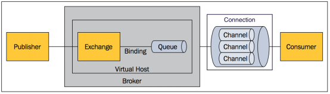

# RabbitMQ基础知识

## 基本概念



### Message
消息，消息是不具名的，它由消息头和消息体组成。消息体是不透明的，而消息头则由一系列的可选属性组成，这些属性包括routing-key（路由键）、priority（相对于其他消息的优先权）、delivery-mode（指出该消息可能需要持久性存储）等。

### Publisher
消息的生产者，也是一个向交换器发布消息的客户端应用程序。

### Exchange
交换器，用来接收生产者发送的消息并将这些消息路由给服务器中的队列。

### Binding
绑定，用于消息队列和交换器之间的关联。一个绑定就是基于路由键将交换器和消息队列连接起来的路由规则，所以可以将交换器理解成一个由绑定构成的路由表。

### Queue
消息队列，用来保存消息直到发送给消费者。它是消息的容器，也是消息的终点。一个消息可投入一个或多个队列。消息一直在队列里面，等待消费者连接到这个队列将其取走。

### Connection
网络连接，比如一个TCP连接。

### Channel
信道，多路复用连接中的一条独立的双向数据流通道。信道是建立在真实的TCP连接内地虚拟连接，AMQP 命令都是通过信道发出去的，不管是发布消息、订阅队列还是接收消息，这些动作都是通过信道完成。因为对于操作系统来说建立和销毁 TCP 都是非常昂贵的开销，所以引入了信道的概念，以复用一条 TCP 连接。

### Consumer
消息的消费者，表示一个从消息队列中取得消息的客户端应用程序。

### Virtual Host
虚拟主机，表示一批交换器、消息队列和相关对象。虚拟主机是共享相同的身份认证和加密环境的独立服务器域。每个 vhost 本质上就是一个 mini 版的 RabbitMQ 服务器，拥有自己的队列、交换器、绑定和权限机制。vhost 是 AMQP 概念的基础，必须在连接时指定，RabbitMQ 默认的 vhost 是 / 。

### Broker
表示消息队列服务器实体。

## 路由类型


### direct

消息中的路由键（routing key）如果和 Binding 中的 binding key 一致， 交换器就将消息发到对应的队列中。路由键与队列名完全匹配，如果一个队列绑定到交换机要求路由键为“dog”，则只转发 routing key 标记为“dog”的消息，不会转发“dog.puppy”，也不会转发“dog.guard”等等。它是完全匹配、单播的模式。


### fanout

每个发到 fanout 类型交换器的消息都会分到所有绑定的队列上去。fanout 交换器不处理路由键，只是简单的将队列绑定到交换器上，每个发送到交换器的消息都会被转发到与该交换器绑定的所有队列上。很像子网广播，每台子网内的主机都获得了一份复制的消息。fanout 类型转发消息是最快的。


### topic

topic 交换器通过模式匹配分配消息的路由键属性，将路由键和某个模式进行匹配，此时队列需要绑定到一个模式上。它将路由键和绑定键的字符串切分成单词，这些单词之间用点隔开。它同样也会识别两个通配符：符号“#”和符号“*”。#匹配0个或多个单词，*匹配不多不少一个单词。


# RabbitMQ分布式集群

## 设计集群的目的

- 允许消费者和生产者在RabbitMQ节点崩溃的情况下继续运行
- 通过增加更多的节点来扩展消息通信的吞吐量


## 集群配置方式
RabbitMQ可以通过三种方法来部署分布式集群系统，分别是：cluster,federation,shovel

### cluster

- 不支持跨网段，用于同一个网段内的局域网
- 可以随意的动态增加或者减少
- 节点之间需要运行相同版本的RabbitMQ和Erlang

### federation

应用于广域网，允许单台服务器上的交换机或队列接收发布到另一台服务器上交换机或队列的消息，可以是单独机器或集群。federation队列类似于单向点对点连接，消息会在联盟队列之间转发任意次，直到被消费者接受。通常使用federation来连接internet上的中间服务器，用作订阅分发消息或工作队列。

### shovel

连接方式与federation的连接方式类似，但它工作在更低层次。可以应用于广域网。
## 节点类型
### RAM node

内存节点将所有的队列、交换机、绑定、用户、权限和vhost的元数据定义存储在内存中，好处是可以使得像交换机和队列声明等操作更加的快速。

### Disk node

将元数据存储在磁盘中，单节点系统只允许磁盘类型的节点，防止重启RabbitMQ的时候，丢失系统的配置信息。

*** 集群中的Disk node在元数据更新时会写入磁盘，只有更新在所有Disk node中都正确写入才会认为更新生效。因此，集群中的Disk node越多，在更新元数据时的效率就越低。同样的，当队列中的消息需要持久化，集群中的Disk node越多，效率也会越低。因此需要在仔细设定集群中的Disk node数量，取得可用性与性能的平衡。 ***

# Cluster模式下队列同步方式

在声明队列时，可以设置队列的模式。

## 普通模式

默认模式。队列会在多个节点中存在备份，但是消息只会路由到其中一个队列，当消费者从其他队列消费时，消息会临时进行同步到目标队列。因此，当收到消息的原始节点故障后，其他节点无法再提供原始节点中消息给消费者。如果原始节点进行了持久化，那么在它重启后，其他节点还能取到消息；否则这些消息就会丢失。

因此，在普通模式下，消费者应该尽可能地连接所有节点，来保证消息得到消费而不丢失。

## 镜像模式

将需要消费的队列变为镜像队列，存在于多个节点，这样就可以实现RabbitMQ的HA高可用性。作用就是消息实体会主动在镜像节点之间实现同步，而不是像普通模式那样，在consumer消费数据时临时读取。缺点就是，集群内部的同步通讯会占用大量的网络带宽。

### 消费时


### 生产时


镜像队列实现了RabbitMQ的高可用性（HA）：

| ha-mode | ha-params | 功能                                                         |
| ------- | --------- | ------------------------------------------------------------ |
| all     |           | 镜像队列将会在整个集群中复制。当一个新的节点加入后，也会在这 个节点上复制一份。 |
| exactly | count     | 镜像队列将会在集群上复制count份。如果集群数量少于count时候，队列会复制到所有节点上。如果大于Count集群，有一个节点crash后，新进入节点也不会做新的镜像。 |
| nodes   | node name | 镜像队列会在node name中复制。如果这个名称不是集群中的一个，这不会触发错误。如果在这个node list中没有一个节点在线，那么这个queue会被声明在client连接的节点。 |

```
queue_args("x-ha-policy":"all") 
channel.queue_declare(queue="hello-queue",argument=queue_args)

queue_args("x-ha-policy":"exactly") 
queue_args("x-ha-params":"6") 
channel.queue_declare(queue="hello-queue",argument=queue_args)

queue_args("x-ha-policy":"nodes") 
queue_args("x-ha-params":"test_node") 
channel.queue_declare(queue="hello-queue",argument=queue_args)
```

# 扩展

## HAProxy 实现负载均衡

 HAProxy可以作为RabbitMQ集群地负载均衡器，运行在第四层，从tcp协议对RabbitMQ的请求进行反向代理，达到负载均衡的效果。 

##  Keepalived 实现主备切换

Keepalived可以作为HAProxy主备切换的控制器，当HAProxy 主节点down机以后，可以使用虚拟ip漂移的方式，切换到备节点。

在两台HAProxy的主机上分别运行着一个Keepalived实例，这两个Keepalived争抢同一个虚IP地址，两个HAProxy也尝试去绑定这同一个虚IP地址上的端口。

显然，同时只能有一个Keepalived抢到这个虚IP，抢到了这个虚IP的Keepalived主机上的HAProxy便是当前的MASTER。

Keepalived内部维护一个权重值，权重值最高的Keepalived实例能够抢到虚IP。同时Keepalived会定期check本主机上的HAProxy状态，状态OK时权重值增加。